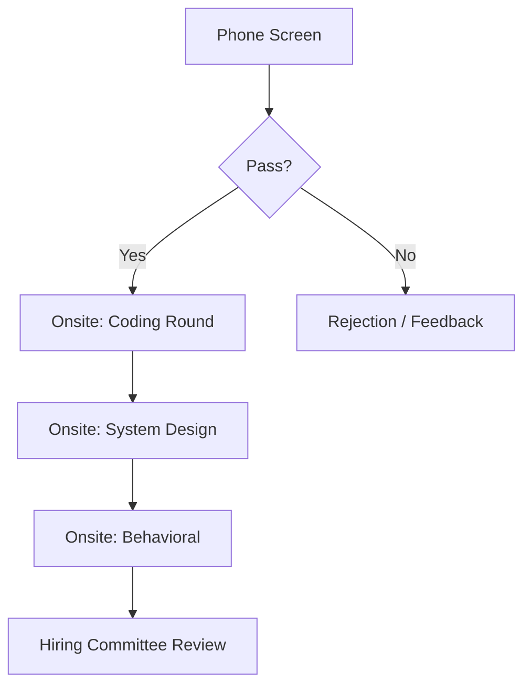
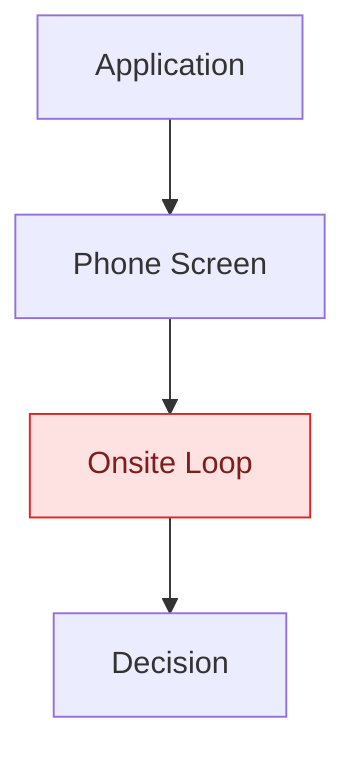

# Visual Guidelines — Mermaid Diagrams & Formatting

The frontend renders Mermaid code blocks directly (via the `mermaid` library) inside
curriculum markdown. Broken Mermaid syntax renders as an ugly error box in the UI, so
correctness here matters as much as content quality.

## Mermaid syntax guardrails

1. **Always quote node labels** that contain spaces, punctuation, or special
   characters: use `A["Behavioral Interview"]` not `A[Behavioral Interview]`. This
   avoids the single most common Mermaid parse failure.
2. **Avoid parentheses inside unquoted labels.** `A[Review (Optional)]` breaks parsing
   in some Mermaid versions — always quote when parentheses, colons, or slashes appear:
   `A["Review (Optional)"]`.
3. **Keep diagrams under ~25 nodes.** Beyond that, diagrams become unreadable in the
   chat/panel width available. If a process has more steps than that, split it into two
   diagrams (e.g. "Phase 1: Application" and "Phase 2: Onsite Loop") or summarize with a
   table instead.
4. **Use simple, short node IDs** (`A`, `B`, `Step1`, `Loop2`) separate from their
   display labels — don't use the label text itself as the node ID.
5. **Terminate statements consistently** — one edge/node definition per line; don't
   chain too many `-->` in a single line, it hurts readability and increases the chance
   of a stray typo breaking the whole block.
6. **Always fence with a language tag**: use ` ```mermaid ` exactly, so the frontend's
   syntax detection picks it up.
7. **Test complexity mentally before emitting** — if you can't clearly picture how the
   diagram renders, simplify it. A correct, simple diagram beats an ambitious, broken one.

## You are solely responsible for syntax correctness

There is no server-side syntax check — a broken ```mermaid block is written as-is and
fails to render for the user (it degrades to a plain code block in the UI). Re-read
every diagram against the guardrails above before submitting section content.

## Which diagram type to use when

- **`flowchart`** (`flowchart TD` or `flowchart LR`): process steps, decision points,
  interview loop stages, "how to approach this problem" step sequences. This is the
  most commonly useful type — default to it when unsure.
- **`sequenceDiagram`**: interactions between parties over time (e.g. candidate ↔
  interviewer exchange in a case interview, recruiter ↔ candidate communication
  timeline).
- **`mindmap`**: breaking a broad topic into categorized sub-topics (e.g. "System Design
  Fundamentals" branching into scalability, data storage, caching, etc.) — good for
  foundational/orientation sections, not for sequential processes.

Don't force a diagram into a section where a table or plain list would communicate more
clearly — a comparison of frameworks is usually a table, not a diagram.

## Example — a correctly quoted flowchart



## Color usage via Mermaid themes/classDefs

When highlighting specific nodes (e.g. "this is the step most candidates fail"), use a
`classDef` block rather than inline styles, and keep the palette restrained (2-3 accent
classes max per diagram):



Don't hardcode colors that assume a light background only — the frontend supports
dark mode (`next-themes`); prefer Mermaid's default theme variables over aggressive
custom fills, and reserve `classDef` highlighting for the rare "pay attention here" node
rather than styling every node.

## Emoji usage in headings

A little goes a long way. It's fine to use a single relevant emoji in a module or
top-level section heading for visual scanning (e.g. "## 🎯 Behavioral Interview
Fundamentals"), and the curriculum's overall `emoji` field represents the whole
curriculum in list views. Do NOT sprinkle emoji throughout body text, bullet points, or
every sub-heading — it reads as noisy and undermines the professional, mentor-like tone
established in `base_system.md`.
