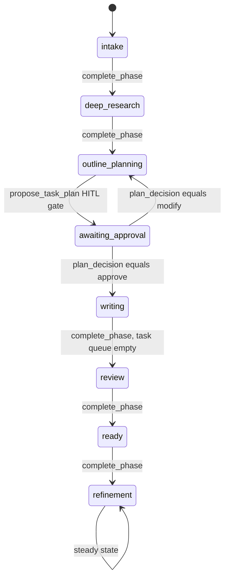

# Agent system deep-dive

This is the flagship document: a complete walkthrough of `backend/app/agent/` — the
ReAct orchestrator, phase state machine, tool catalog, layered memory with
auto-compaction, prompt files, and human-in-the-loop (HITL) mechanics. It traces real
code (`orchestrator.py`, `memory/manager.py`, `memory/compaction.py`, `stream_split.py`,
`tools/*.py`) against the binding contract in
[docs/specs/02-agent-system-spec.md](../specs/02-agent-system-spec.md), and ends with a
fully worked example tracing actual events and Firestore writes for one curriculum run.

## 1. The big picture

A single `Orchestrator` (`backend/app/agent/orchestrator.py`) runs one bounded ReAct
loop — "run a turn" — per incoming WS frame (`user_message` or `plan_decision`). Each
turn:

1. Loads the conversation/curriculum's current agent state from Firestore
   (`curricula/{id}/state/main`).
2. Loops up to `AGENT_MAX_ITERATIONS` (default 60) times:
   - Assembles the full LLM context (`MemoryManager.build_context`, §5).
   - Streams a completion from the active `LLMProvider`, splitting `<thinking>` from
     answer text as it arrives (`ThinkingStreamSplitter`, §4).
   - If the model requested tool calls, executes each via `ToolRegistry`, streaming
     `tool_call_start`/`tool_call_result` events, and checks whether a HITL gate tool
     fired.
   - If no tool calls: the turn ends with a plain-text answer (`DONE`).
   - If a HITL gate tool fired: the turn ends `PAUSED` — no further iteration happens
     until the next WS frame (an approval/modify decision, or a new user message).
   - Otherwise: loop again — tool results are now in context as observations.
3. Persists `iteration_count` and phase transitions to Firestore on every iteration, so a
   crashed process or disconnected client can resume exactly where it left off.

## 2. Phase state machine



This exact graph is enforced in code, not just convention: `CompletePhaseTool`
(`app/agent/tools/control.py`) has a `_VALID_TRANSITIONS` map and rejects (returns an
`{"error": ...}` observation, doesn't crash) any `complete_phase` call to a phase not
listed as reachable from the current one. The `awaiting_approval → writing` and
`awaiting_approval → outline_planning` edges are **not** driven by `complete_phase` at
all — they're driven by the orchestrator's `_apply_plan_decision` handling an incoming
`plan_decision` WS frame (see §7).

Each phase has a dedicated instruction file composed into the system prompt (§6) and a
tool allowlist (§3) restricting what the LLM can even attempt to call.

| Phase | Prompt file | Curriculum status set | Key tools available |
|---|---|---|---|
| `intake` | `intake_phase.md` | `researching` (on creation) | always-available only |
| `deep_research` | `research_phase.md` | `researching` | `web_search`, `fetch_url`, `save_research_note`, `search_research_notes`, `list_research_notes` |
| `outline_planning` | `planning_phase.md` | `planning` | `search_research_notes`, `list_research_notes`, `propose_task_plan`, `get_task_plan` |
| `awaiting_approval` | `planning_phase.md` | `awaiting_approval` | `get_task_plan` only (research/writing tools hidden) |
| `writing` | `writing_phase.md` | `writing` | research tools + `list_curriculum_structure`, `write_section`, `write_curriculum_overview`, `set_module_status`, `get_task_plan` |
| `review` | `writing_phase.md` | `writing` | `list_curriculum_structure`, `read_section`, `write_section`, `write_curriculum_overview`, `set_module_status`, `search_research_notes` |
| `ready` | `refinement_phase.md` | `ready` | full refinement toolset (below) |
| `refinement` | `refinement_phase.md` | `ready` | `list_curriculum_structure`, `read_section`, `update_section`, `write_section`, `search_research_notes`, `list_research_notes`, `web_search`, `fetch_url`, `save_research_note` |

`_ALWAYS_AVAILABLE = ["get_user_profile", "update_scratchpad", "complete_phase",
"request_user_input"]` is unioned into every phase's list in
`backend/app/agent/tools/registry.py`'s `_PHASE_TOOLS` map. Note `review` and `ready`
both map their curriculum `status` differently than their tool-availability role might
suggest — `review`'s status is still `"writing"` (from `CompletePhaseTool`'s
`status_map`), and `ready`'s prompt file is actually `refinement_phase.md` (the
`_PHASE_PROMPT_FILES` map in `memory/manager.py` reuses it for both `ready` and
`refinement`) — `ready` is really just the entry moment into steady-state refinement.

## 3. The ReAct loop, step by step (`orchestrator.py`)

`Orchestrator.run_turn(...)` is the public entry point (called once per WS frame from
`app/ws/chat.py`). It:

1. Looks up `get_conversation_lock(conversation_id)` — an `asyncio.Lock` from a
   `defaultdict`, one per conversation id, process-wide. If already locked, emits a
   recoverable `error` ("An agent run is already active...") and returns immediately —
   this is the concurrency guard: **one active run per conversation**, enforced without
   any Firestore-level locking.
2. Inside the lock, clears that conversation's cancel `asyncio.Event`
   (`_clear_cancel`), then delegates to `_run_turn_inner`, with a top-level
   `try/except Exception` around it so a bug in the loop can never crash the WS
   connection — it emits a generic `error` event instead.

`_run_turn_inner` does the actual work:

1. Resolves the LLM/search providers for this run, honoring the user's per-account
   override (`fs.get_user(owner_uid)["settings"]["llm_provider"/"search_provider"]`) over
   the server default. `small_llm` is **the same provider instance** — `small=True`
   routing to the small model happens *inside* each provider implementation, not via a
   separate object.
2. Records the turn's trigger: a plain string `user_message` is appended to
   `conversations/{id}/messages` immediately; a `PlanDecision` instead calls
   `_apply_plan_decision` (§7) — there is no chat message for a plan decision itself.
3. Loads `synthesized_profile` (from `users/{uid}/profile/main`) and the agent state doc
   (`curricula/{id}/state/main`), defaulting to `{"phase": "intake", "task_queue": [],
   "scratchpad": "", "iteration_count": 0}` if none exists yet.
4. Enters the iteration loop (`for iteration in range(max_iterations)`):
   - **Cancellation check** (top of loop): if the cancel event is set, persists
     `iteration_count`, emits `agent_done(status="cancelled")`, returns `CANCELLED`.
   - Re-reads the agent state fresh from Firestore every iteration (`phase` may have
     changed due to a `complete_phase` call in the previous iteration).
   - Calls `MemoryManager.build_context(...)` (§5) to assemble the full message list,
     passing an `on_compaction` closure that emits the WS `compaction` event if
     compaction fires this iteration.
   - Builds an `AgentContext` (`app/agent/tools/base.py`) bundling everything a tool
     needs: ids, settings, both LLM providers, search provider, current phase, and the
     `emit` callable.
   - Generates a fresh `message_id`, emits `message_start`.
   - Fetches `tool_specs = registry.specs_for_phase(phase)` and opens
     `llm.chat_stream(messages, tools=tool_specs)`.
   - **Streams**: for each `TextDelta`, feeds it through a per-iteration
     `ThinkingStreamSplitter` (§4), emitting `reasoning_delta`/`text_delta` as text
     arrives; checks the cancel event between chunks too (not just at loop top) so a
     `stop` mid-generation is responsive. `ToolCallDelta`s accumulate into a list;
     `Done` is a no-op marker.
   - On LLM stream exception: logs, emits `error` + `message_end`, returns `ERROR`
     immediately (no retry).
   - On cancellation mid-stream: flushes the splitter, still persists the partial
     assistant message (with whatever reasoning/text arrived) to Firestore before
     returning `CANCELLED` — cancellation never discards partial output.
   - **No tool calls** → persist the assistant message, emit `message_end`, bump
     `iteration_count`, emit `agent_done(status="ok")`, return `DONE`.
   - **Tool calls present** → for each tool call (in order): emit `tool_call_start`,
     `await registry.execute(...)`, pop any `_ws_events`/`_ws_event`/`_hitl_gate` keys
     out of the raw tool output (these are orchestrator-only signaling — never sent to
     the LLM or the client as part of the JSON preview), truncate the remaining JSON to
     `TOOL_OUTPUT_PREVIEW_CHARS = 1500` chars for the `tool_call_result` event, then emit
     any extra WS events the tool requested (`plan_proposed`, `phase_change`,
     `curriculum_updated`, `progress`). Track whether any executed tool was a HITL gate
     tool that returned `status == "ok"`.
   - After all tool calls: persist one assistant message row with all
     `tool_call_records` attached, emit `message_end`, bump `iteration_count`.
   - If a HITL gate fired this step: emit `agent_done(status="paused")`, return
     `PAUSED` — **the loop exits here**, even if `max_iterations` hasn't been reached.
   - Otherwise: loop again (the `for` continues) — tool observations are now part of the
     persisted conversation, so the next `build_context` call picks them up.
5. If the loop exhausts `max_iterations` without a `DONE`/`PAUSED`/`CANCELLED`: emits an
   `error` ("reached the maximum number of reasoning iterations") + `agent_done(status=
   "max_iterations")`, returns `ERROR`.

### Cancellation

`request_stop(conversation_id)` (module-level function in `orchestrator.py`) just calls
`.set()` on that conversation's `asyncio.Event` from a `defaultdict`. The WS `stop`
frame handler calls this directly and synchronously (no `await`, no lock needed — it's
just flipping a flag another coroutine polls). The running turn observes it in up to two
places per iteration: the loop-top check, and the `async for event in stream:` loop
(checked on every chunk). Either way, partial output already produced is persisted
before returning.

### Concurrency guard

One `asyncio.Lock` per conversation id (`_conversation_locks: dict[str, asyncio.Lock] =
defaultdict(asyncio.Lock)`), created lazily and never explicitly cleaned up (a bounded
memory cost proportional to distinct conversation ids ever seen by the process — not
addressed by any eviction, acceptable for the current scale). Both this and the
cancel-event dict live at module scope in `orchestrator.py`, so they're shared across
every `Orchestrator` instance in the process (a fresh `Orchestrator(settings)` is
actually constructed per WS connection in `app/ws/chat.py`, but the locks/events are
keyed globally by conversation id regardless of which orchestrator instance touches
them).

## 4. `<thinking>` stream-splitting — `stream_split.py`

The system prompt (`base_system.md`) instructs the model to always open its response
with a `<thinking>...</thinking>` block containing its private reasoning, then write the
user-facing reply after the closing tag. Because this is just a textual convention
inside the ordinary completion stream, it works identically for OpenAI, Gemini, and
llama.cpp — the orchestrator never has to know which provider produced the text.

`ThinkingStreamSplitter` is a small incremental state machine (`_buffer`, `_in_thinking`,
`_seen_thinking`, `_finished_thinking_phase`) that can be fed arbitrarily-sized chunks
(a streaming API can split `<thinking>` or `</thinking>` across chunk boundaries, even
character-by-character) and always emits the correct reasoning/text split without
buffering the whole response:

- While not yet decided whether the response opens with `<thinking>`: it strips leading
  whitespace and checks if the buffered-so-far text is a *prefix* of `<thinking>`. If it
  might still become the open tag with more characters, it waits (`return out` with
  nothing emitted yet) rather than guessing wrong.
- Once inside a thinking block, it hunts for `</thinking>`, holding back only the
  suffix of the buffer that could still be a partial close tag (`_safe_emit_length`) so
  reasoning text streams out live rather than only at block-close.
- The instant the model has definitively **not** opened with `<thinking>` (buffer
  diverges from the tag), or the close tag is found, `_finished_thinking_phase` latches
  `True` and everything from then on — even a stray literal `<thinking>`-looking
  substring later in the answer — is treated as plain text. The model is only expected
  to open the block at the very start of a response.
- `flush()` (called once at stream end) emits any trailing buffered content: as
  `reasoning` if a thinking block was left unclosed (defensive — still surfaces to the
  user as visible "thinking" rather than being silently dropped), otherwise as `text`.

This is unit-tested exhaustively in `backend/tests/test_stream_split.py`, including
tag-split-across-many-tiny-chunks (character-by-character feeding) and "text starting
with an angle bracket that isn't `<thinking>`" (e.g. `<b>bold</b>` is correctly treated
as plain text, not a false-positive thinking block).

## 5. Tool catalog (`app/agent/tools/`)

Every tool subclasses `Tool` (`app/agent/tools/base.py`): a `name`, LLM-facing
`description`, a pydantic `input_model`, and an async `execute(input, ctx) -> dict`.
`Tool.json_schema()` calls `input_model.model_json_schema()` and strips the `title` key
(providers don't need it). Tools receive an `AgentContext` (curriculum/conversation/
owner ids, settings, both LLM providers, search provider, current phase, and an optional
`emit`). All 17 concrete tools are instantiated once in `ToolRegistry.__init__`
(`app/agent/tools/registry.py`) and looked up by name.

### Research tools (`tools/research.py`)

| Tool | Input | What it does |
|---|---|---|
| `web_search` | `query`, `max_results=8 (1-20)` | Calls `ctx.search.search(...)`, returns `{results: [{title,url,snippet}], count}`. |
| `fetch_url` | `url` | SSRF-guarded fetch (§ backend.md §10) + lightweight stdlib-`HTMLParser`-based text extraction (`_html_to_text`), truncated to `_TRUNCATE_CHARS = 32_000` chars (~8k tokens). Returns `{url, text, truncated, length_chars}` or `{"error": ...}`. |
| `save_research_note` | `query, url, title, summary, key_facts[], relevance` | Writes a `curricula/{id}/research/{noteId}` doc via `fs.create_research_note`. Returns `{note_id}`. |
| `search_research_notes` | `keywords` | Keyword/substring scoring (`_score_note`: counts keyword occurrences across `summary + key_facts + relevance + title`, case-insensitive) over all notes for this curriculum, returns the top 15 with `count > 0`, sorted descending. |
| `list_research_notes` | (none) | Compact `{id, title, url, relevance}` listing of every note — used for coverage orientation. |

### User-memory tool (`tools/user_memory.py`)

`get_user_profile` — reads `users/{uid}/profile/main` and returns the synthesized
profile plus structured fields (`target_roles`, `experience_level`, `learning_style`,
`timeline`, `skills`, `goals`, `background`). Mostly redundant with the always-injected
working-memory user block (§5 of the memory section below), but useful to re-check
precisely or if the profile changed mid-run.

### Planning tools (`tools/planning.py`)

- **`propose_task_plan`** (HITL gate) — `outline_markdown`, `tasks: [{id, title,
  description, module_ref, status}]`. Reads the existing plan (if any) to compute
  `next_version = existing.version + 1` and preserve accumulated `user_feedback`, writes
  `curricula/{id}/plan/main`, sets curriculum `status="awaiting_approval"`, sets agent
  state `phase="awaiting_approval"`, and returns an output dict carrying
  `_ws_event: {"type": "plan_proposed", "plan": {...}}` and `_hitl_gate: True`. The
  orchestrator strips those two underscored keys before building the client-visible
  `tool_call_result` preview, and uses `_hitl_gate` to know to pause after this tool
  executes.
- **`get_task_plan`** — returns the whole plan doc verbatim, or `{"error": "no plan
  exists yet..."}`.

### Curriculum tools (`tools/curriculum.py`)

- **`list_curriculum_structure`** — nested `{modules: [{id, order, title, status,
  sections: [{id, order, title, status}]}]}`, no content bodies — cheap orientation.
- **`write_section`** — `module_id, section_id, title, content_markdown, citations[]`.
  **Validates**: if `content_markdown` is over 400 stripped characters and `citations`
  is empty, returns an error observation instructing the model to add citations or
  shorten the section — this is the concrete enforcement of the "citations are
  non-negotiable" rule. On success: stamps `accessed_at` (server `utcnow()`) onto every
  citation, creates or updates the section doc (preserving `order` if the section
  already existed), marks the matching plan task `"done"` and pops it from the agent
  state's `task_queue` (via the internal `_mark_task_done` helper — also updates
  `current_task_id` to the new head of the queue), refreshes the curriculum's
  `module_count`/`section_count` (`_refresh_curriculum_counts`), and returns two WS
  events: `curriculum_updated(scope="section", module_id, section_id)` and
  `progress(completed, total, detail="Wrote section: {title}")` where
  `completed/total` come from counting `status=="done"` tasks in the plan.
- **`read_section`** — full section doc or `{"error": "...not found..."}`. The
  refinement prompt mandates calling this before any `update_section`.
- **`update_section`** — like `write_section` but requires the section to already exist,
  takes a `change_note` (surfaced to the user as a changelog line), does **not** run the
  400-char citation-required check that `write_section` does, and emits only
  `curriculum_updated` (no `progress` event, since this isn't task-queue-driven).
- **`write_curriculum_overview`** — sets `overview`, `emoji`, `tags` on the curriculum
  doc; emits `curriculum_updated(scope="overview")`.
- **`set_curriculum_title`** — `title` (<=80 chars), optional `emoji`. Always available
  (in `_ALWAYS_AVAILABLE`, not phase-gated) so the model can call it as one of its first
  actions in `intake` to replace the placeholder title (the raw user prompt, truncated to
  80 chars by `POST /api/conversations`) with something concise and human-friendly. Sets
  `curricula/{id}.title` (and `.emoji` if provided) via `fs.update_curriculum`, and also
  `conversations/{id}.title` via `fs.update_conversation` so the sidebar/dashboard stay
  in sync; emits `curriculum_updated(scope="curriculum")` — same event shape as
  `write_curriculum_overview`'s, so the existing frontend refetch path handles it
  unchanged.
- **`set_module_status`** — bookkeeping helper to flip a module's `planned/writing/
  complete` status independent of any specific section write.

Internal helpers at the bottom of `curriculum.py` (`_next_section_order`,
`_mark_task_done`, `_task_progress`, `_refresh_curriculum_counts`) are not tools
themselves — they're plain functions the tools above call.

### Control tools (`tools/control.py`)

- **`request_user_input`** (HITL gate) — `question`, optional `options: list[str]`.
  Notably this tool does **not** touch Firestore or emit a dedicated WS event at all —
  it just returns `{"status": "awaiting_user_input", "question", "options",
  "_hitl_gate": True}`. The question is expected to already be present as the model's
  own visible chat text (streamed via `text_delta` in the same turn); the frontend is
  responsible for rendering the *message* as a question card, not this tool's output.
- **`update_scratchpad`** — overwrites `curricula/{id}/state/main.scratchpad` in one
  shot (not append — full overwrite each time, so the model must include everything
  worth keeping, not just a delta).
- **`complete_phase`** — `next_phase`, `reason`. Validates `next_phase` is a real
  `AgentPhase` literal and that the transition from `ctx.phase` is in
  `_VALID_TRANSITIONS` (§2); on success sets the state doc's `phase`, maps to a
  curriculum `status` via `status_map`, and returns a `_ws_event:
  {"type": "phase_change", "phase", "label"}` using a friendly `label_map` (e.g.
  `deep_research` → `"Researching"`, `awaiting_approval` → `"Awaiting your approval"`).

### HITL gate tools (`registry.HITL_GATE_TOOLS = {"propose_task_plan",
"request_user_input"}`)

`ToolRegistry.is_hitl_gate(name)` checks membership in this set — this is the
*registry-level* backstop; the orchestrator actually pauses if **either** this check is
true **or** the tool's own output dict set `_hitl_gate: True` (both tools currently do
both), so a gate fires even if one signaling path were ever removed.

### Registry execution safety (`ToolRegistry.execute`)

Every path is wrapped so **nothing a tool does can crash the orchestrator loop**:
unknown tool name → `{"error": "unknown tool: ..."}"`; pydantic `ValidationError` on
input → `{"error": "invalid input for {name}: {exc}"}`; a raised `ToolExecutionError` →
`{"error": str(exc)}`; any other bare exception → logged with `logger.exception(...)`
and converted to `{"error": "tool {name} failed: {exc}"}`. `status` on the returned
`ToolResult` is `"error"` whenever the output dict contains an `"error"` key (regardless
of which path produced it), `"ok"` otherwise — this is what streams to the client as
`tool_call_result.status` and what the loop uses to color/animate the tool-call card.

## 6. Memory & context management (`app/agent/memory/`)

`MemoryManager.build_context(...)` (`memory/manager.py`) is called fresh on **every**
ReAct iteration (not once per turn) — so a phase change mid-turn (via `complete_phase`)
is reflected in the very next iteration's prompt.

### Layer 1 — Static system prompt

`build_static_system_prompt(phase)` concatenates, separated by `\n\n---\n\n`:
1. `base_system.md` (always).
2. The phase's instruction file, looked up via `_PHASE_PROMPT_FILES` (§2 table) —
   defaulting to `refinement_phase.md` for any unrecognized phase string (defensive
   fallback, exercised by `test_build_static_system_prompt_unknown_phase_falls_back_to_refinement`).
3. `citation_guidelines.md` (always).
4. `visual_guidelines.md` (always).

All four are loaded from `backend/app/agent/prompts/*.md` through a module-level
`PromptLibrary` (`_prompt_library`) that caches file contents in a dict keyed by
filename after first read — so disk I/O happens once per process, not once per
iteration.

### Layer 2 — User memory

`build_user_memory_block(synthesized_profile, profile)` renders `"About the user:
{synthesized_profile}"` plus a `Structured profile fields: {target_roles,
experience_level, learning_style, timeline}` dict rendered as Python repr (not JSON —
worth knowing if you're debugging prompt content). If both are `None`, renders a
literal "no profile information available yet" fallback rather than an empty block.

### Layer 3 — Working memory

`build_working_memory_block(state)` renders a fixed-format block: `phase`,
`task_queue`, `current_task_id`, `iteration_count`, and the full `scratchpad` text (or
`"(empty)"`). This is explicitly documented as "authoritative, always current" in its
own rendered text — `base_system.md` instructs the model to trust this over anything
implied by earlier chat history.

### Layer 4 — Episodic memory (conversation)

`build_context` loads the conversation doc for `summary`/`compacted_through`, then
`fs.list_messages(conversation_id)` (all messages, ordered by `seq`). If
`compacted_through` is set, only messages **after** that message id are kept as
`recent_messages` — everything before it is represented only by the `summary` string
appended as a fourth system block (`"Summary of earlier conversation:\n\n{summary}"`).

Before assembly, `truncate_old_tool_outputs` (`memory/compaction.py`) copies the
message list, identifies which messages carry `tool_calls`, and for every such message
**except the last `RECENT_TOOL_EXCHANGES_KEPT_FULL = 6`**, truncates each tool call's
`output_preview` to `TOOL_OUTPUT_PREVIEW_CHARS = 300` chars with an `"... [truncated]"`
suffix. This runs on every `build_context` call regardless of whether compaction fires —
it's a separate, cheaper lever for keeping context lean (full tool data always still
lives in Firestore research notes / sections, retrievable via tools).

`_message_to_chat_messages` converts each stored Firestore message dict into one or more
`ChatMessage`s: a plain `user`/`assistant` message with no tool calls becomes one
`ChatMessage`; an `assistant` message *with* `tool_calls` becomes one `ChatMessage(role=
"assistant", tool_calls=[...])` followed by one `ChatMessage(role="tool", ...)` **per**
tool call — reconstructing the OpenAI-style multi-message tool-exchange shape that both
provider adapters expect (Gemini's adapter further translates this into its own
`function`-role content parts).

### Layer 5 — Research memory (not injected)

Research notes are deliberately **never** part of the assembled context — they're
retrieved only on demand via `search_research_notes`/`list_research_notes`/
`list_curriculum_structure`/`read_section`. This is the single biggest lever keeping
context lean during `writing`, since a curriculum can accumulate a large, uncapped
number of comprehensive notes (however many the topic's coverage areas warrant) and many
sections whose combined text would otherwise dwarf the token budget.

### Auto-compaction algorithm (`memory/compaction.py` + the tail of `build_context`)

After assembling the full message list once, `build_context` estimates its token count
(`estimate_tokens`, §below) over the joined content of every assembled `ChatMessage`.
If `tokens_before > COMPACTION_TRIGGER_FRACTION (0.8) * settings.context_token_limit`
**and** a `small_llm` was passed **and** there are more than 2 candidate messages:

1. `select_messages_to_compact(candidate_messages)` splits at
   `cutoff = max(1, int(len(messages) * 0.6))` (or `0` if there's only one message,
   meaning nothing gets compacted) into `(older, remaining)`.
2. If `older` is non-empty: `run_compaction(small_llm, existing_summary, older)` calls
   the small model (`llm.complete(..., small=True)`) with `compaction.md` as the system
   prompt and a user message containing the existing rolling summary (if any) plus every
   older message rendered via `_render_message_for_summary` (role, seq, a 200-char
   reasoning preview, content, and one line per tool call with a 200-char output
   preview).
3. The new summary **replaces** `conversations/{id}.summary`,
   `compacted_through` is set to the id of the last compacted message
   (`older[-1]["id"]`), and `token_estimate` is updated — all via one
   `fs.update_conversation(...)` call.
4. The system blocks list is rebuilt with the new summary swapped in for the old one
   (or appended fresh if there wasn't one), and the message list is **reassembled from
   only `remaining`** (the newer ~40%) — this smaller `assembled` list, not the original
   over-budget one, is what actually gets returned and sent to the LLM this iteration.
5. `on_compaction(preview, tokens_before, tokens_after)` fires if provided — the
   orchestrator's callback turns this straight into a WS `compaction` event
   (`summary_preview` = first 300 chars of the new summary).

If compaction does **not** fire (below threshold, or no `small_llm`, or trivially few
messages), `build_context` still updates `conversations/{id}.token_estimate` before
returning, so the running estimate stays visible even between compactions.

**Token estimation** (`memory/tokens.py`): `estimate_tokens(text)` uses a
`@lru_cache`d `tiktoken.get_encoding("cl100k_base")` encoder when available, falling
back to a `len(text) // 4` heuristic (minimum 1) if `tiktoken`'s BPE data can't load
(e.g. fully offline environments without cached files) — logged once as a warning, not
per call.

## 7. HITL pause/resume mechanics end to end

Two tools pause the loop: `propose_task_plan` and `request_user_input`. Both are also
enforced to be called **alone** per the prompt instructions in `base_system.md`
("Don't call other tools in the same batch as one of these gate tools") — this isn't
code-enforced (the model could technically batch them with others), but the orchestrator
correctly pauses on `PAUSED` regardless of what else was in the batch, since
`hit_hitl_gate` is set to `True` if *any* executed call this step was a successful gate
call.

**Pausing**: the turn returns `RunResult(TurnOutcome.PAUSED)` after emitting
`agent_done(status="paused")`. No special "paused" flag is stored anywhere beyond the
ordinary phase (`awaiting_approval` for the plan gate) and whatever the question tool
left in the transcript — resumption is just "the next WS frame that arrives."

**Resuming a plan gate**: the client sends `{"type": "plan_decision", "decision":
"approve"|"modify", "feedback": str|null}`. `app/ws/chat.py` constructs a
`PlanDecision` and spawns a new `orchestrator.run_turn(..., user_input=decision, ...)`
task. Inside `_run_turn_inner`, because `user_input` is a `PlanDecision` (not a `str`),
no chat message is appended — instead `_apply_plan_decision(curriculum_id, decision)`
runs synchronously before the iteration loop starts:
- **`approve`**: sets `plan.status = "approved"`, calls
  `_materialize_modules_and_sections` (creates `curricula/{id}/modules/{moduleId}` docs
  grouped by each task's `module_ref` — title derived from the first task's title up to
  its first `:`, truncated to 80 chars — and `curricula/{id}/modules/{mid}/sections/
  {sectionId}` stub docs, one per task, `status="planned"`, skipping any that already
  exist so re-approval after a crash doesn't duplicate), computes the not-yet-`done`
  task ids as the new `task_queue`, sets agent state `phase="writing"` with
  `current_task_id` = the first queued task, and sets curriculum `status="writing"`.
  Finally appends a synthetic `role:"system"` message via `fs.append_message` stating the
  plan was APPROVED (with its version number), that stubs are materialized and the phase
  is now `writing`, and instructing the model to begin the first task immediately without
  asking for confirmation again — this is what lets the very next iteration's model turn
  see that the approval already happened instead of re-asking the user.
- **`modify`**: appends `feedback` (if given) to the plan's `user_feedback` list, sets
  `plan.status = "revising"`, sets agent state back to `phase="outline_planning"`, sets
  curriculum `status="planning"`, then appends a synthetic `role:"system"` message
  restating the user's feedback text and instructing the model to revise the outline and
  re-propose via `propose_task_plan`. The next iteration's `outline_planning` prompt
  (which includes the full accumulated `user_feedback` via working memory /
  `get_task_plan`, plus this system message) guides the model to revise and call
  `propose_task_plan` again (which auto-increments `version`).

Both branches take `conversation_id` (threaded through from `_run_turn_inner`) precisely
so `_apply_plan_decision` can append these messages — the model has no other way to know
a plan decision was applied, since `plan_decision` frames don't produce an ordinary chat
message of their own.

**Resuming a clarifying question**: the client just sends an ordinary
`{"type": "user_message", "content": "..."}` frame with the user's answer — there's no
special decision type for this gate; it's handled identically to any other chat turn,
relying on the working-memory/conversation-history context (including the assistant's
own question text) for the model to understand what it's responding to.

## 8. Prompt files — what each does and how they compose

All ten files live in `backend/app/agent/prompts/` and are treated as code (per the root
`CLAUDE.md`). Word/line counts below are approximate (from `wc -l`).

| File | ~Lines | Used by | Purpose |
|---|---|---|---|
| `base_system.md` | 131 | Every phase (always layer 1) | Identity, the `<thinking>` ReAct convention, tool-error adaptation rules, tone, the "no fabricated citations" hard rule, the personalization mandate, phase discipline, HITL gate etiquette, scratchpad hygiene, tool-call efficiency guidance. |
| `intake_phase.md` | 57 | `intake` | What to figure out (interview type, scope, constraints) from the user's message + profile; strict guidance on when to ask a clarifying question vs. proceed (err toward proceeding); curriculum naming; exit via `complete_phase("deep_research")`. |
| `research_phase.md` | ~115 | `deep_research` | The 6 query-diversification coverage areas (format/stages; foundational skills; real sample questions; sample answers/frameworks; prep roadmaps; company/domain specifics); source-quality heuristics; mandatory fetch-before-note rule (snippets are relevance triage only; a failed fetch means skip the source, never note-from-snippet); note-taking standards (long, comprehensive, multi-paragraph summaries — roughly 150-500+ words — written from the fetched full text, sufficient that `writing` never needs to re-fetch); qualitative stop criteria (all relevant areas covered with fetched-and-distilled notes, diminishing returns — no numeric note-count target); anti-patterns (no duplicate notes, don't retry dead ends, don't pad or artificially cap count). |
| `planning_phase.md` | ~95 | `outline_planning`, `awaiting_approval` | The beginner→interview-ready module arc (foundations → core skills → question drills → mock/strategy); no fixed module/section count — scope driven by researched material and user goals, timeline respected via priority ordering rather than a count cap; every module needs a sample-Q&A section; task-plan field contract; how `propose_task_plan` behaves as a HITL gate; how to incorporate `modify` feedback on revision (read all feedback, targeted changes, top-up research if needed). |
| `writing_phase.md` | 89 | `writing`, `review` | Per-task workflow (search notes → optional targeted top-up research → `write_section`); markdown/Mermaid/table/callout formatting standards; sample-Q&A authoring standard (personalize to the user's actual background); 800-2000 word/section length guidance; "ground everything in research first" mandate; resumability via `update_scratchpad`; exit via `complete_phase("review")` when the task queue is empty. |
| `refinement_phase.md` | 67 | `ready`, `refinement` | Three request types and how to handle each: edits (read-before-write, minimal targeted changes, preserve citations, `change_note`), explanations (teach in chat, never silently modify content), additions/deep-dives (scoped targeted research, not a full re-run of `deep_research`). |
| `citation_guidelines.md` | 79 | Every phase (always layer 3) | The exact `[^n]` marker mechanics, the `## Sources` footnote section format, the `citations` array contract (must mirror footnotes exactly), the hard "no fabricated URLs" rule, and a checklist of what does/doesn't need a citation. |
| `visual_guidelines.md` | 84 | Every phase (always layer 4) | Mermaid syntax guardrails (always quote labels, avoid unquoted parens, cap ~25 nodes, short node IDs, one edge per line, always fence with `` ```mermaid ``); which diagram type for which content (flowchart default, sequenceDiagram for party interactions, mindmap for topic breakdowns); a worked correct example; `classDef`-based highlighting restrained to 2-3 accent classes; sparse, heading-only emoji usage. |
| `profile_synthesis.md` | 63 | Onboarding `/api/onboarding/synthesize` endpoint only (small model, no tools) | Transforms raw onboarding fields + resume text into a 200-350 word third-person profile covering background, strengths, gaps vs. target roles, learning style translated into content-design guidance, and 2-4 concrete personalization hooks. Explicitly: no fabrication, no meta-commentary, plain prose only. |
| `compaction.md` | 76 | `MemoryManager`'s auto-compaction only (small model, no tools) | What to preserve (key decisions, user preferences/corrections, curriculum/plan state, open threads) vs. drop (pleasantries, superseded tool detail, dead-end reasoning, full tool payloads); fixed-heading structured markdown output contract (`## Key Decisions` / `## User Preferences & Corrections` / `## Curriculum & Plan State` / `## Open Threads`); how to merge with an existing rolling summary (later decision wins, trim oldest/least-actionable first). |

Composition per phase, concretely (from `_PHASE_PROMPT_FILES` in `memory/manager.py`):
`intake`→`intake_phase.md`, `deep_research`→`research_phase.md`,
`outline_planning`→`planning_phase.md`, `awaiting_approval`→`planning_phase.md` (same
file — the plan file covers both drafting and the paused-approval state),
`writing`→`writing_phase.md`, `review`→`writing_phase.md` (same file — review is really
"finish writing plus a final pass"), `ready`→`refinement_phase.md`,
`refinement`→`refinement_phase.md`. `profile_synthesis.md` and `compaction.md` are
loaded directly by their respective call sites (`app/api/onboarding.py` and
`app/agent/memory/compaction.py`) rather than through `MemoryManager`'s phase
composition, since they're one-shot small-model tasks outside the ReAct loop entirely.

## 9. Worked example: prompt → research → plan → approve → writing → ready

This traces the actual sequence of WS events and Firestore writes for a fresh
curriculum, referencing the real functions/tools involved at each step.

**1. User submits a prompt on the dashboard.**
`POST /api/conversations {curriculum_prompt: "Google SWE system design interview"}` →
`app/api/conversations.py:create_conversation` creates `conversations/{convId}` and
`curricula/{curId}` (`status="researching"`), seeds
`curricula/{curId}/state/main = {phase: "intake", task_queue: [], scratchpad: "",
iteration_count: 0}`. Frontend routes to `/studio/{convId}`.

**2. Studio connects the WS**, receives `session_ready`, then sends
`{"type": "user_message", "content": "Google SWE system design interview"}` (the very
first user message, mirroring the original prompt — the composer sends it as an
ordinary chat turn).

**3. `intake` phase runs** (one orchestrator iteration): `build_context` composes
`base_system.md + intake_phase.md + citation_guidelines.md + visual_guidelines.md` as
layer 1, the user's synthesized profile as layer 2, the fresh state doc as layer 3. The
model's `<thinking>` reasons about scope; since "Google SWE system design" is
unambiguous, it proceeds without `request_user_input`, calls `complete_phase(
"deep_research", reason="scope is clear")`. This tool call: validates the transition,
sets state `phase="deep_research"`, sets curriculum `status="researching"` (unchanged),
emits WS `phase_change{phase: "deep_research", label: "Researching"}`. The assistant's
visible text (something like "Great — I'll research Google's SWE system design
interview process now.") streams as `text_delta`s, persisted as one assistant message
with the `complete_phase` tool call attached. Loop continues (no HITL gate fired).

**4. `deep_research` phase runs for several iterations.** Each iteration: the model
issues a batch of diverse `web_search` calls (covering the 6 coverage areas from
`research_phase.md`) used only for relevance triage; every promising result then gets a
mandatory `fetch_url` call (SSRF-guarded) — useful pages get distilled into
`save_research_note` calls from the fetched full text (long, comprehensive summaries),
each writing a `curricula/{curId}/research/{noteId}` doc; a failed fetch means the source
is skipped rather than noted from its snippet. Periodically the model calls
`list_research_notes` to self-check coverage. Once every relevant coverage area has
solid fetched-and-distilled notes and new searches hit diminishing returns (no fixed
note-count target), it calls `complete_phase("outline_planning",
...)` → state `phase="outline_planning"`, curriculum `status="planning"`, WS
`phase_change{label: "Planning the curriculum"}`.

**5. `outline_planning` phase**: the model calls `search_research_notes`/
`list_research_notes` to review its evidence base, drafts an outline sized to what the
research and the user's goals warrant (no fixed module/section count) and personalized
to the user's profile, then calls `propose_task_plan(outline_markdown,
tasks=[...])` — **alone**, per prompt instruction. This writes
`curricula/{curId}/plan/main` (`version: 1, status: "proposed"`), sets curriculum
`status="awaiting_approval"`, sets state `phase="awaiting_approval"`, and the tool's
output carries `_ws_event: {"type": "plan_proposed", "plan": {...}}` +
`_hitl_gate: true`. The orchestrator emits `tool_call_result` then the `plan_proposed`
event, marks `hit_hitl_gate = True`, persists the assistant message, emits
`agent_done(status="paused")`. **The turn returns `PAUSED`.** The frontend renders the
plan-approval card from the `plan_proposed` payload; the composer is disabled while
awaiting a decision.

**6. User clicks "Approve & build."** Frontend sends `{"type": "plan_decision",
"decision": "approve", "feedback": null}`. A new `run_turn` starts;
`_apply_plan_decision` runs before any LLM call: `plan.status = "approved"`,
`_materialize_modules_and_sections` creates the module docs (grouped by `module_ref`)
and section stub docs (`status: "planned"`, one per task) under
`curricula/{curId}/modules/...`, computes `task_queue` from all non-`done` task ids,
sets state `phase="writing"`, `current_task_id` = first task, sets curriculum
`status="writing"`. *Then* the iteration loop starts fresh in the `writing` phase.

**7. `writing` phase runs one task at a time.** Per task: `search_research_notes` pulls
relevant notes; occasionally a targeted top-up `web_search`+`save_research_note`; then
`write_section(module_id, section_id, title, content_markdown, citations)`. Each
successful `write_section` call: validates non-empty citations for substantial content,
writes/overwrites the section doc, marks the task `done` in the plan and pops it from
`task_queue` (updating `current_task_id`), refreshes `module_count`/`section_count` on
the curriculum, and emits both `curriculum_updated{scope:"section", module_id,
section_id}` and `progress{completed, total, detail}`. The frontend's Workflow view
animates the corresponding module/section node on `curriculum_updated`; the phase
banner and any progress bar update on `progress`. This repeats autonomously — no HITL
pause — until `task_queue` is empty, at which point the model calls
`complete_phase("review", ...)`.

**8. `review` phase**: the model calls `list_curriculum_structure` to confirm every
section is `complete`, spot-checks a few sections for citation coverage
(`read_section`), calls `write_curriculum_overview(overview_markdown, emoji, tags)`
(emits `curriculum_updated{scope:"overview"}`), then `complete_phase("ready", ...)` →
state `phase="ready"`, curriculum `status="ready"`, WS `phase_change{label: "Ready"}`.

**9. Steady state.** The turn ends `DONE` (plain text, e.g. "Your curriculum is ready!
Take a look, and let me know if you'd like anything explained or adjusted."), emits
`agent_done(status="ok")`. Any further user message in this conversation now runs in
`refinement` phase — edits go through `read_section` → `update_section`; pure
explanations stay in chat without touching content; additions may trigger a small
scoped research-then-write cycle exactly as `refinement_phase.md` describes.

Throughout this entire example, note what's **resumable for free**: if the process
crashed at any point (say, mid-`writing`), `curricula/{curId}/state/main` already has
the current `phase`, `task_queue`, and `current_task_id` up to date as of the last
completed tool call — a fresh `run_turn` on the next user message (or even the same
frame retried) picks up the working memory block, sees exactly what's done, and
continues without re-deriving anything from chat history alone.

## Related documents

- [backend.md](backend.md) — everything *around* the agent: app bootstrap, REST/WS
  transport, Firestore repositories, provider factories, security.
- [frontend.md](frontend.md) — how the Studio renders every event described above.
- `backend/app/agent/CLAUDE.md` — terse scoped guidance for editing this code.
