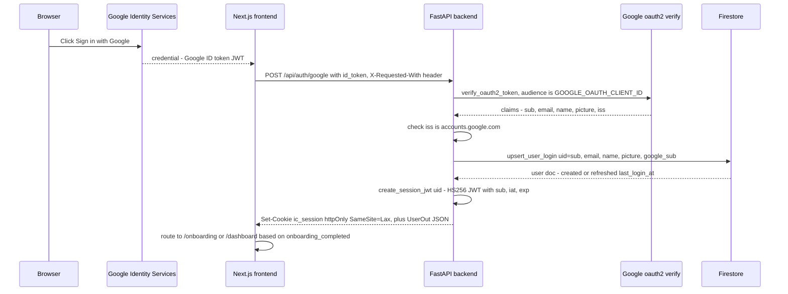
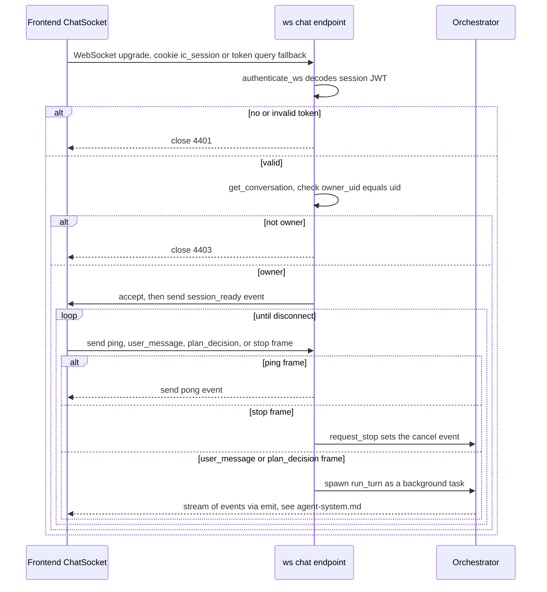

# Backend deep-dive

This is a full walkthrough of `backend/` — the FastAPI server that hosts the agentic
system, REST API, and WebSocket chat protocol. It complements
[docs/specs/01-architecture-and-contracts.md](../specs/01-architecture-and-contracts.md)
(the binding contract) with "how it's actually implemented" detail, real file paths, and
function names. For the agent core itself (orchestrator, tools, memory, prompts) see the
companion doc [agent-system.md](agent-system.md) — this document covers everything
*around* the agent: app bootstrap, auth, REST routers, the WS endpoint's transport
layer, Firestore, LLM/search provider plumbing, resume parsing, and security.

## 1. App factory & startup

Entry point: `backend/app/main.py`, function `create_app()`. It:

1. Loads `Settings` via `get_settings()` (see §2).
2. Calls `configure_logging("DEBUG" if app_env == "development" else "INFO")` —
   `backend/app/core/logging.py`.
3. Builds the `FastAPI` instance and adds `CORSMiddleware` with
   `allow_origins=[settings.frontend_origin]`, `allow_credentials=True` (required for the
   cookie-based session to work cross-origin in dev, where frontend :3000 and backend
   :8000 are different origins).
4. Includes routers in this order: `health`, `auth`, `onboarding`, `curricula`,
   `conversations`, `settings`, and the WS routers (`app/ws/chat.py`, `app/ws/dashboard.py`
   — importing the latter also registers its firestore change-listener as a side effect,
   see §5b).
5. Registers a startup event that logs `app_env` and `default_model` (the first
   `OPENAI_MODEL` entry — there's no single fixed provider to log anymore since model
   selection is per-conversation).
6. Module-level `app = create_app()` — this is what `uvicorn app.main:app` serves.

Run it locally with `uvicorn app.main:app --reload --port 8000` (from `backend/`, inside
the venv).

## 2. Configuration — `app/core/config.py`

`Settings` is a `pydantic-settings` `BaseSettings` subclass, loaded once via
`get_settings()` (`@lru_cache`, so it's a process-wide singleton — env vars are read
exactly once per process). It reads `.env` (via `env_file=".env"`) and real environment
variables, case-insensitively, ignoring unknown keys (`extra="ignore"`).

Two fields have **no default and are required**: `session_jwt_secret` and
`google_oauth_client_id`. Because pydantic-settings validates eagerly, a missing value
for either **fails fast at import time** — the app will not start, and you'll see a
`pydantic_core.ValidationError` naming the missing field. This is intentional (see the
troubleshooting section of [setup-local.md](setup-local.md)).

Every other field has a sane default matching `docs/specs/01-architecture-and-contracts.md
§4` exactly: `app_env`, `port`, `frontend_origin`, `session_jwt_expires_min`,
`firebase_project_id`, `google_application_credentials`, `firestore_emulator_host`,
`openai_api_key`/`openai_model`/`openai_base_url`, `gemini_api_key`/`gemini_model`,
`google_cse_api_key`/`google_cse_engine_id`/`tavily_api_key`, `agent_max_iterations`
(60), `context_token_limit` (100,000). `Settings.is_production` is a convenience
property (`app_env == "production"`) used to decide whether the session cookie gets
`Secure`.

`openai_model`/`gemini_model` are RAW comma-separated strings (env var names unchanged)
— three derived properties do the real work: `openai_models`/`gemini_models` (`list[str]`,
split on `,`, stripped, empties dropped) and `default_model` (the first entry of
`openai_models`, falling back to the first of `gemini_models` if that's somehow empty).
There is no more `llm_provider`/`search_provider` field, and no separate
`openai_small_model`/`gemini_small_model` — model selection is per-conversation now (see
§5) rather than a single server-wide default, and there's no "small model" concept
(compaction/profile synthesis just use a normal provider instance for whichever model
applies).

## 3. Auth flow end to end

### 3.1 Sequence: Google ID token → session cookie



Implementation:
- `backend/app/core/security.py`:
  - `verify_google_id_token(id_token_str, settings)` uses
    `google.oauth2.id_token.verify_oauth2_token` with a shared
    `google.auth.transport.requests.Request()` instance, checks audience internally (via
    the SDK call) and re-checks `iss` is `accounts.google.com` or
    `https://accounts.google.com` explicitly. Raises `InvalidGoogleTokenError` on any
    failure (missing `sub`/`email`, wrong issuer, bad signature, expired, etc).
  - `create_session_jwt(uid, settings)` mints `{sub: uid, iat, exp}` signed HS256 with
    `SESSION_JWT_SECRET`, expiring after `SESSION_JWT_EXPIRES_MIN` minutes (default 10080
    = 7 days).
  - `decode_session_jwt(token, settings)` verifies and returns the `sub` claim, raising
    `InvalidSessionTokenError` on any `PyJWTError` or a missing `sub`.
  - `SESSION_COOKIE_NAME = "ic_session"`.
- `backend/app/api/auth.py`:
  - `POST /api/auth/google` — depends on `require_csrf_header` (see §3.3), verifies the
    Google token, calls `fs.upsert_user_login(...)`, mints the session JWT, sets the
    cookie via `_set_session_cookie` (`httponly=True`, `samesite="lax"`,
    `secure=settings.is_production`, `max_age=session_jwt_expires_min*60`, `path="/"`),
    returns `UserOut`.
  - `POST /api/auth/logout` — depends on `require_csrf_header`, clears the cookie.
  - `GET /api/auth/me` — depends on `get_current_user`, returns `UserOut` (404→401 if the
    user doc has vanished, which shouldn't normally happen).
- On first login, `fs.upsert_user_login` (in `app/services/firestore.py`) creates
  `users/{uid}` with `settings: {theme: "system"}` and `onboarding_completed: false`
  (no `llm_provider`/`search_provider` anymore — those moved to per-conversation
  composer chips). Subsequent logins just refresh `last_login_at`, `name`, `picture`.

### 3.2 Request-scoped auth dependencies — `app/core/deps.py`

- `get_current_user(request, settings)` — reads the `ic_session` cookie only (no header
  fallback for REST; that's WS-only), decodes it, returns `CurrentUser(uid=...)`. Raises
  401 if missing/invalid.
- `get_optional_user` — same but returns `None` instead of raising (unused by any current
  route, but available for future public-ish endpoints).
- `require_owner(owner_uid, user)` — raises **404** (not 403) if
  `owner_uid != user.uid`, deliberately to avoid leaking whether a resource exists to a
  non-owner.
- `get_owned_curriculum(curriculum_id, user)` / `get_owned_conversation(conversation_id,
  user)` — fetch-then-ownership-check helpers used by every curricula/conversations route
  that takes an id. This is the concrete mechanism behind the "ownership check on every
  document access" rule in the root `CLAUDE.md`.

### 3.3 CSRF mitigation

`require_csrf_header(request)` raises **403** unless the request header
`X-Requested-With: XMLHttpRequest` is present. It's wired as a route-level
`dependencies=[Depends(require_csrf_header)]` on every mutating route (`POST`, `PUT`,
`DELETE`) — `auth.google_login`, `auth.logout`, `onboarding.put_onboarding`,
`onboarding.upload_resume`, `onboarding.synthesize_profile`,
`curricula.delete_curriculum`, `conversations.create_conversation`,
`settings.put_settings`. Because it's a router-level dependency, FastAPI resolves it
**before** the function-parameter `get_current_user` dependency runs — confirmed by
`test_auth_and_csrf.py::test_delete_curriculum_without_csrf_header_rejected`, which shows
a request with neither cookie nor header gets 403 (CSRF-first), not 401. Combined with
`SameSite=Lax` on the cookie, this blocks classic cross-site form/script CSRF since a
cross-origin request can't set arbitrary headers on a simple (non-preflighted) request.

### 3.4 Rate limiting

`app/core/deps.py` also defines an in-memory per-uid token-bucket `RateLimiter`
(`agent_rate_limiter = RateLimiter(capacity=20, refill_per_second=0.2)`), invoked via
`enforce_rate_limit(user)` which raises **429** when exhausted. It's called explicitly
inside `conversations.create_conversation` and `onboarding.synthesize_profile` — the two
REST endpoints that trigger LLM calls. It is *not* a global middleware and is
process-local (fine for a single instance; would need a shared store like Redis to work
correctly across multiple Cloud Run instances, which is a known simplification per spec
01 §8: "in-memory token bucket is fine").

## 4. REST routers

All routers live in `backend/app/api/` and are mounted with their own `prefix` in
`main.py`. Every response model is a pydantic model from `backend/app/models/`.

| Router file | Prefix | Routes |
|---|---|---|
| `health.py` | (none) | `GET /api/healthz` — no auth, liveness probe |
| `auth.py` | `/api/auth` | `POST /google`, `POST /logout`, `GET /me` |
| `onboarding.py` | `/api/onboarding` | `GET ""`, `PUT ""`, `POST /resume`, `POST /synthesize` |
| `curricula.py` | `/api/curricula` | `GET ""`, `GET /{id}`, `DELETE /{id}`, `PATCH /{id}`, `GET /{id}/plan` |
| `conversations.py` | `/api/conversations` | `GET ""`, `POST ""`, `GET /{id}/messages` |
| `models.py` | `/api/models` | `GET ""` — read-only, no CSRF dependency |
| `settings.py` | `/api/settings` | `GET ""`, `PUT ""` |

Notable implementation details per router:

- **`onboarding.py`**:
  - `upload_resume` reads the whole file into memory (`await file.read()`), calls
    `parse_resume(raw_bytes, filename, content_type)` (see §9), and on success stores
    only `resume_filename` + extracted `resume_text` via `fs.upsert_profile` — the raw
    bytes are never persisted anywhere.
  - `synthesize_profile` loads `agent/prompts/profile_synthesis.md` directly off disk
    (via a local `_load_profile_synthesis_prompt()` helper — note this duplicates the
    "read a prompt file" pattern rather than reusing `MemoryManager`'s `PromptLibrary`;
    see the accuracy notes at the end of this doc), renders the profile's raw fields into
    a flat `key: value` block (`_render_input_block`), and calls `get_llm_provider()`
    (no args — always the server default, first `OPENAI_MODEL` entry, since there's no
    conversation here to inherit a selection from) then `llm.complete(messages)`.
- **`curricula.py`**: `get_curriculum_full` nests modules and their sections into one
  `CurriculumFull` response — this is a full N+1 read pattern (`list_modules` then
  `list_sections` per module) but is the only way the current Firestore repo layer
  supports it, and curriculum sizes are bounded (4–8 modules × 3–6 sections) so it's
  cheap in practice. `update_curriculum` (the PATCH route handler, distinct from
  `firestore.update_curriculum`) backs the dashboard favorite star and the studio rename
  dialog: it validates `title` (stripped, non-empty, ≤100 chars) and `description`
  (≤500 chars) — the same hard caps as `create_module`/`update_module` — and only bumps
  `updated_at` when title/description actually changed, so a favorite-only toggle doesn't
  reshuffle `list_curricula`'s recency-sorted dashboard grid.
- **`conversations.py`**: `create_conversation` is the one place a curriculum gets born.
  If `curriculum_prompt` is provided, it creates both a `conversations/{id}` doc and a
  linked `curricula/{id}` doc (`status="researching"`), and seeds
  `curricula/{id}/state/main` with `phase="intake"` and an empty task queue — this is the
  state the orchestrator will read on the very first WS `user_message` frame. The request
  body also accepts optional `selected_model`/`search_provider` (the dashboard prompt
  box's chip selections); when present they're resolved via `resolve_model`/
  `resolve_search_provider` and the RESOLVED values are persisted on the new conversation
  doc — a null/omitted value is left null rather than resolved to the default, so the doc
  can still distinguish "never chosen" from "chose the default".
- **`models.py`**: `GET /api/models` is a pure computed response over
  `available_models(settings)` / `available_search_providers(settings)` plus
  `settings.default_model` / `DEFAULT_SEARCH_PROVIDER` — backs the dashboard prompt box's
  chips, which have no WS connection yet to hydrate from (unlike the studio composer's
  `session_ready`-driven chips).
- **`settings.py`**: `UserSettings`/`UserSettingsUpdate` now only carry `theme` (LLM
  model / search provider are per-conversation composer chips, not user settings
  anymore). `PUT` uses `body.model_dump(exclude_unset=True)` so a client can send a
  partial update without clobbering other fields; `fs.update_user_settings` merges
  rather than replaces (still generic — an explicit `null` clears a key back to
  default). `ApiModel`'s `extra="ignore"` config means a stored `users/{uid}.settings`
  doc still carrying the old `llm_provider`/`search_provider` keys from before this
  change deserializes fine — those keys are just dropped on parse.

## 5. WebSocket endpoint lifecycle

Endpoint: `GET /ws/chat/{conversation_id}`, implemented in `backend/app/ws/chat.py`.



Key mechanics:
- **Auth**: `_authenticate_ws` reads `ws.cookies.get(SESSION_COOKIE_NAME)` first, falling
  back to the `?token=` query parameter — the fallback exists because not every
  WebSocket client/browser attaches cookies identically on the upgrade request in every
  environment. Close codes are in the private-use range: `4401` (unauthenticated),
  `4403` (not the owner).
- **One task per turn**: each incoming `user_message`/`plan_decision` frame spawns an
  `asyncio.create_task(_run_turn_safely(...))` rather than awaiting inline — this lets
  the WS receive loop keep accepting frames (like a subsequent `stop`) while a turn runs.
  `_run_turn_safely` wraps `orchestrator.run_turn` in a try/except so a bug inside the
  agent loop can't silently kill the background task without at least being logged.
- **`emit`**: a closure over the `ws` and a `send_lock` (`asyncio.Lock`) — every event is
  JSON-serialized (`json.dumps(event, default=str)`, so datetimes serialize fine) and
  sent under the lock to avoid interleaving writes if multiple emits somehow race (they
  currently don't, since only one turn runs per conversation at a time, but the lock is
  cheap insurance).
- **`stop` frame**: calls `request_stop(conversation_id)` in
  `app/agent/orchestrator.py`, which just sets a per-conversation `asyncio.Event`. The
  orchestrator's loop polls this event between iterations and mid-stream (see
  agent-system.md §"Cancellation").
- Only `user_message` and `plan_decision` frames require `curriculum_id` on the
  conversation; if the conversation was created without a `curriculum_prompt` (rare —
  every current frontend flow always supplies one), those frames are rejected with a
  recoverable `error` event.
- On `WebSocketDisconnect`, the handler just logs and returns — there's no explicit
  cleanup of the conversation lock/cancel-event dicts (they're keyed by conversation id
  and just persist for the process lifetime; harmless memory growth, not addressed by
  any TTL/cleanup).
- **Model/search-provider selection**: `session_ready` carries `available_models`
  (`available_models(settings)`), `selected_model` (the conversation's persisted
  selection, resolved/validated via `resolve_model`), `search_providers`
  (`available_search_providers(settings)`), and `search_provider` (resolved via
  `resolve_search_provider`) — this is what hydrates the composer's model/search chips
  on connect. `user_message`/`plan_decision`/`compact` frames may carry optional
  `model`/`search_provider` fields (the chips' current selections); these are forwarded
  straight to `Orchestrator.run_turn`/`compact_now`, which resolve them (frame value →
  the conversation doc's persisted selection → server default) and persist the resolved
  value back onto the conversation doc when it changes.
- **Reader "current section" chip**: a `user_message` frame may also carry
  `section_context: {module_id, section_id}` (the composer's toggle chip). The handler
  only forwards it as `run_turn`'s `section_context` kwarg when it's a dict with
  non-empty string `module_id`/`section_id`; any other shape (wrong type, missing field)
  is silently normalized to `None` — no error frame. `run_turn`/`_run_turn_inner` then
  re-validate the ids against the curriculum before injecting a system-role note (see
  `docs/guides/agent-system.md` §7); on success, the resolved `{module_id, section_id,
  label}` snapshot is also stamped onto the persisted user message doc so the frontend
  can render an inline chip, including on history replay.

## 5b. Dashboard WebSocket — `app/ws/dashboard.py`

Endpoint: `GET /ws/dashboard` — a second, much simpler WS endpoint than the chat one
above, replacing the dashboard grid's old 8s `curriculaApi.list()` polling with push-based
updates. Auth reuses `_authenticate_ws` imported straight from `app.ws.chat` (same cookie/
`?token=` fallback, same 4401 close code). Unlike the chat WS's single "live connection"
per conversation, `_connections: dict[uid, set[_DashboardConnection]]` keeps every
concurrently-open dashboard tab for a user, since there's no reason to only serve the
latest one. The receive loop only understands `{"type": "ping"}` (replies `pong`); every
other frame is silently ignored — this socket is otherwise read-only from the client.

The interesting half is the change-signal path, split across two modules on purpose to
keep `firestore.py`'s repo layer free of WS imports:
- `app/services/firestore.py` exposes `register_curriculum_listener(fn)`, appending to a
  module-level `_curriculum_listeners` list, and calls every registered `fn(curriculum_id,
  owner_uid_or_None)` (wrapped per-listener in try/except, logged at debug on failure —
  never allowed to break the write it followed) at the end of `create_curriculum`,
  `update_curriculum`, and `delete_curriculum`. `create_curriculum` passes the `owner_uid`
  it already has; `update_curriculum` passes `None` (not cheaply available there);
  `delete_curriculum` reads `owner_uid` off the doc *before* deleting (it's unreadable
  after) so it can still be passed post-delete.
- `app/ws/dashboard.py` registers its own `notify_curriculum_changed` onto that registry
  at import time (`fs.register_curriculum_listener(notify_curriculum_changed)` at module
  scope) — this is why including the dashboard router in `main.py` is what actually wires
  the signal up. `notify_curriculum_changed` is itself synchronous (matching the
  synchronous firestore call sites): a cheap fast-path returns immediately if
  `_connections` is empty (no Firestore read at all when nobody's watching), otherwise it
  schedules `_notify_curriculum_changed_async(...)` via
  `asyncio.get_running_loop().create_task(...)` (wrapped in try/except RuntimeError, so a
  sync test context with no running loop just no-ops instead of raising). The async task
  re-fetches the curriculum (`fs.get_curriculum`); if it still exists, it's converted to a
  `CurriculumSummary` via `app.api.curricula._to_summary` (imported, not duplicated) and
  pushed as `curriculum_updated` to every one of `doc["owner_uid"]`'s sockets; if it's
  gone and an `owner_uid` hint was supplied, `curriculum_deleted` is pushed instead. Sends
  are per-connection under each connection's own `send_lock`, wrapped in try/except so one
  dead socket (send raises) is dropped from the registry without affecting delivery to the
  others.

**Known limitation**: this broker is in-process only — on a multi-instance Cloud Run
deployment a dashboard socket only sees events from writes handled by an agent run on the
*same* instance. Acceptable for the current single-instance deploy; the frontend's
`DashboardSocket` refetches the full list once on reconnect to cover the gap.

## 6. Firestore service & schema — `app/services/firestore.py`

`get_firestore_client()` is an `@lru_cache`d factory that lazily creates one
`firebase_admin` app named `"interview-blueprint"` (a fixed name, not the default app — this
lets tests re-import the app without "app already exists" errors) and returns a
`firestore.client()` bound to it. Initialization branches three ways:
1. `FIRESTORE_EMULATOR_HOST` set → sets the env var (if not already) and initializes
   with just a `projectId` (credentials aren't checked against the emulator).
2. `GOOGLE_APPLICATION_CREDENTIALS` set (and no emulator) → `credentials.Certificate(path)`.
3. Neither set → `firebase_admin.initialize_app()` with no explicit credential, which
   falls back to **application default credentials** — this is the path used
   automatically on Cloud Run (the runtime service account).

Every other function in this module is a thin, typed wrapper around a Firestore
collection/document path, grouped by comment banners matching the schema in spec 01 §5:
`users/{uid}`, `users/{uid}/profile/main`, `curricula/{id}` (+ `modules`/`sections`
subcollections), `curricula/{id}/plan/main`, `curricula/{id}/sources/{sourceId}`,
`curricula/{id}/state/main`, `conversations/{convId}` (+ `messages` subcollection).
**None of these functions check ownership** — that responsibility is explicitly pushed
to callers (API routes via `get_owned_curriculum`/`get_owned_conversation`, or the
orchestrator/tools which are only ever invoked with an already-authenticated,
already-owned `curriculum_id`/`conversation_id` from the WS handshake).

Noteworthy repository behaviors:
- `append_message` computes the next `seq` by querying the single highest existing `seq`
  descending-ordered-limit-1 — not a Firestore transaction, so under true concurrent
  writers there's a narrow race window; acceptable given the one-run-per-conversation
  lock ensures the orchestrator itself never writes messages concurrently for the same
  conversation.
- `delete_curriculum` performs a **best-effort recursive delete**: walks
  `modules → sections` deleting leaves first, then saved `sources`, then the singleton
  `plan/main` and `state/main` docs, then the curriculum doc itself. There's no batching
  or transaction — for pathologically large curricula this could be slow, but curricula
  are bounded in size by design.
- `list_curricula`/`list_conversations` both order by `updated_at DESCENDING` — this is
  what makes the dashboard's "most recently active first" ordering work without any
  client-side sorting.

## 7. LLM provider abstraction — `app/services/llm/`

`base.py` defines the provider-neutral contract every implementation satisfies:

```python
class LLMProvider(Protocol):
    async def chat_stream(self, messages: list[ChatMessage], tools: list[ToolSpec] | None = None) -> AsyncIterator[LLMEvent]: ...
    async def complete(self, messages: list[ChatMessage]) -> str: ...
```

There is no `small` parameter and no "small model" concept — each provider INSTANCE is
bound to exactly one model at construction, so compaction and profile synthesis just use
a normal provider instance for whichever model applies (the conversation's selected
model for compaction; the server default for profile synthesis, which has no
conversation to inherit from).

`LLMEvent = TextDelta | ReasoningDelta | ToolCallDelta | Done`. Providers themselves split
reasoning (`ReasoningDelta`) from answer text (`TextDelta`) using each API's native
reasoning fields — OpenAI-compatible `reasoning_content`/`reasoning` delta fields, Gemini
thought-summary parts — so the orchestrator just forwards events, it does no parsing
itself (see agent-system.md §4). Providers only emit a `ToolCallDelta` once a tool call's
name+arguments are **fully assembled** — the orchestrator never sees partial tool-call
JSON fragments, regardless of provider.

- **`openai_provider.py` (`OpenAIProvider`)** — wraps `openai.AsyncOpenAI`. Constructor
  requires an API key *unless* `base_url` is set, in which case it substitutes the
  literal string `"not-needed"` (local OpenAI-compatible servers typically
  don't check the key). `chat_stream` accumulates streamed `tool_calls` deltas into a
  `pending_calls: dict[int, {...}]` keyed by the OpenAI stream's per-call `index`,
  concatenating `arguments` JSON string fragments until the stream ends, then
  `json.loads`-parses each (falling back to `{}` on parse failure, logged as a warning)
  and yields one `ToolCallDelta` per assembled call, followed by a final `Done
  (finish_reason=...)`.
- **`gemini_provider.py` (`GeminiProvider`)** — wraps `google.genai.Client`. Requires
  `GEMINI_API_KEY`. `_translate_schema` recursively converts our JSON-schema `ToolSpec`
  parameters into Gemini's `Schema` dict shape (`STRING`/`NUMBER`/`INTEGER`/`BOOLEAN`/
  `ARRAY`/`OBJECT` type names). `_split_system_and_contents` separates `system`-role
  `ChatMessage`s into one joined `system_instruction` string (Gemini takes system
  instructions out-of-band from `contents`), maps `tool`-role messages to a `function`
  role `Part.from_function_response`, and `assistant`→`model` / everything else→`user`.
  Tool calls from Gemini are synthesized IDs (`f"gemini-call-{call_counter}"`) since
  Gemini's function-calling protocol doesn't hand back a call id the way OpenAI's does.
- **`factory.py`**: model-based resolution, not a fixed provider name.
  `resolve_model(model, settings) -> (provider_name, model_id)` searches
  `settings.openai_models` first, then `settings.gemini_models` (only if
  `gemini_api_key` is set — no working client otherwise); a `None`/unknown/unavailable
  request falls back to `(provider-of-default, settings.default_model)` (logging a
  warning for unknown non-`None` values). `available_models(settings)` lists the
  composer's model-chip options (all OpenAI models, then Gemini models when the key is
  set, deduped by id). `get_llm_provider(model, settings)` resolves via `resolve_model`
  then calls an `@lru_cache`d `_build_provider(provider_name, model_id)` — the cache key
  now includes the model id, since each distinct model gets its own provider instance
  (no more single-instance-with-small-model-routing). Providers are effectively
  singletons per `(provider, model)` pair — cheap since they're stateless aside from
  their configured HTTP client.
- **Self-hosted / OpenAI-compatible endpoints**: there is no separate provider value for
  this. Point an `OPENAI_MODEL` entry at any OpenAI-compatible server (vLLM, Ollama,
  LM Studio, etc.) by setting `OPENAI_BASE_URL` to that server's URL — the same
  `OpenAIProvider` client is reused, exactly as the root `CLAUDE.md` describes.

### How streaming events flow to the client

`OpenAIProvider`/`GeminiProvider` → `LLMEvent` stream → `Orchestrator._run_turn_inner`
(`backend/app/agent/orchestrator.py`) routes each event by type as it arrives:
`ReasoningDelta` → WS `reasoning_delta`, `TextDelta` → WS `text_delta` — no
orchestrator-side parsing, since the provider already separated native reasoning from
answer text (`reasoning_content`/`reasoning` fields for OpenAI-compatible endpoints,
thought-summary parts for Gemini; see agent-system.md §4).
`ToolCallDelta`s are buffered until the stream ends, then executed one at a time via
`ToolRegistry.execute`, each producing `tool_call_start`/`tool_call_result` WS events.
Full detail (including the phase state machine driving which tools are visible) is in
[agent-system.md](agent-system.md).

## 8. Search provider abstraction — `app/services/search/`

`base.py`: `SearchProvider.search(query, max_results=8) -> list[SearchResult{title, url,
snippet}]`.

- **`duckduckgo.py` (`DuckDuckGoSearchProvider`)** — the default, keyless provider. Uses
  the synchronous `ddgs.DDGS().text(...)` call, run in a thread executor
  (`loop.run_in_executor(None, _search_sync, ...)`) to keep the async interface honest.
  On `RatelimitException` it logs a warning, sleeps 2 seconds (`_RETRY_DELAY_SECONDS`),
  and retries exactly once; a second failure (or any other `DDGSException`) returns an
  **empty list** rather than raising — search failures degrade gracefully rather than
  erroring the tool call.
- **`google_cse.py` (`GoogleCSESearchProvider`)** — calls
  `https://www.googleapis.com/customsearch/v1` via `httpx`, requires both
  `GOOGLE_CSE_API_KEY` and `GOOGLE_CSE_ENGINE_ID` (raises `ValueError` in the constructor
  if either is empty). Caps `num` to Google's hard max of 10 results per request
  regardless of the requested `max_results`.
- **`tavily.py` (`TavilySearchProvider`)** — POSTs to `https://api.tavily.com/search`
  with `include_raw_content: False`; maps Tavily's `content` field to our `snippet`.
- **`factory.py`**: `DEFAULT_SEARCH_PROVIDER = "duckduckgo"` (always available, keyless).
  `available_search_providers(settings)` lists the composer's search-chip options:
  duckduckgo always, plus google when BOTH `google_cse_api_key`/`google_cse_engine_id`
  are set, plus tavily when `tavily_api_key` is set. `resolve_search_provider(name,
  settings)` validates a requested name against that list, falling back to the default
  for `None`/unknown/unavailable requests. `get_search_provider(name, settings)`
  resolves via `resolve_search_provider` then calls an `@lru_cache`d
  `_build_provider(name)`.

## 9. Resume parsing — `app/services/resume_parser.py`

`parse_resume(raw_bytes, *, filename, content_type)` is the single entry point, called
only from `onboarding.upload_resume`. Enforcement order:
1. Empty file → `ResumeParsingError("uploaded file is empty")`.
2. `len(raw_bytes) > MAX_RESUME_BYTES` (5 MiB) → `ResumeParsingError("file exceeds the
   5MB size limit")`.
3. `_resolve_kind(filename, content_type)` — trusts `content_type` first against an
   allowlist (`application/pdf`, the DOCX OOXML mimetype, `text/plain`); if the
   content-type is missing/wrong, falls back to matching the filename extension
   (`.pdf`/`.docx`/`.txt`). Anything else raises `ResumeParsingError("unsupported file
   type...")`.
4. Dispatches to `_parse_pdf` (`pypdf.PdfReader`, joins `page.extract_text()` across
   pages), `_parse_docx` (`python-docx`, joins paragraph `.text`), or `_parse_txt`
   (`utf-8` decode, falling back to `latin-1` with `errors="replace"` on
   `UnicodeDecodeError`). Each raises `ResumeParsingError` if the extracted text is blank
   (e.g. a scanned-image PDF with no text layer).

Everything happens on an in-memory `io.BytesIO` — the raw file bytes are never written
to disk and never persisted; only the extracted `text` and original `filename` are
stored in Firestore (`users/{uid}/profile/main.resume_text` /
`.resume_filename`), per spec 01 §8.

## 10. Security measures summary

- **SSRF guard on `fetch_url`** (`app/agent/tools/research.py`, `_guard_url` /
  `_is_blocked_ip`): only `http`/`https` schemes allowed; the hostname is resolved via
  `socket.getaddrinfo` and **every** resolved address is checked against
  `ipaddress.ip_address(...).is_private / is_loopback / is_link_local / is_multicast /
  is_reserved / is_unspecified` — if any resolved address is blocked, the whole fetch is
  refused (defends against DNS rebinding to a public-looking name that actually resolves
  to `127.0.0.1` or an internal IP). Unparsable IP strings are blocked defensively.
  Covered by `backend/tests/test_ssrf_guard.py`.
- **Fetch limits**: 10-second timeout, follows redirects, rejects non-text/html content
  types outright. The full page is read and converted to Markdown; the only cap is a
  defensive 200k-char/page slice (flagged `content_truncated`) protecting Firestore's
  1 MiB document limit.
- **Rate limiting**: see §3.4 — in-memory per-uid token bucket on
  conversation-creation and profile-synthesis endpoints.
- **Upload limits**: see §9 — 5 MB cap, content-type/extension allowlist, in-memory only,
  never executed or stored raw.
- **Structured logging** (`app/core/logging.py`): a `StructuredFormatter` emits one-line
  JSON log records (`ts`, `level`, `logger`, `message`, plus any `extra_fields`) suitable
  for Cloud Run's log ingestion. The module docstring explicitly warns callers never to
  pass secrets/tokens/resume text into `extra_fields` — this is a convention enforced by
  code review, not by the formatter itself (it does no redaction).
- **CORS**: locked to exactly `settings.frontend_origin` (a single origin, not a
  wildcard), with `allow_credentials=True` so the session cookie is sent cross-origin in
  local dev.
- **Cookie flags**: `httponly=True` always; `secure=settings.is_production` (only sent
  over HTTPS in production — in local dev over `http://localhost` the cookie is
  intentionally non-Secure so it still gets set); `samesite="lax"`.

## 11. How the tests mock everything

`backend/tests/conftest.py` sets required env vars (`SESSION_JWT_SECRET`,
`GOOGLE_OAUTH_CLIENT_ID`, etc.) as `os.environ.setdefault(...)` calls **before** any
`app.*` import happens anywhere in the session — necessary because `Settings` validates
eagerly and `app.main` builds the FastAPI `app` object at import time, so if a test
module imported `app.main` before env vars were set, the import itself would raise.

Two central fixtures:
- **`fake_fs`** — a `FakeFirestore` class holding plain Python dicts (`users`,
  `profiles`, `curricula`, `modules`, `sections`, `plans`, `sources`, `states`,
  `conversations`, `messages`) that mirror the real Firestore schema shape. The fixture
  monkeypatches every public function in `app.services.firestore` (`get_user`,
  `upsert_user_login`, `create_curriculum`, `append_message`, etc.) onto this in-memory
  store, one-for-one matching the real module's function signatures — so any code that
  does `from app.services import firestore as fs; fs.get_curriculum(...)` transparently
  hits the fake instead, with **no real network/credentials needed**. `store.fs` exposes
  the patched module itself so tests can call e.g. `fake_fs.fs.create_conversation(...)`
  directly to set up scenarios.
- **Scripted/fake LLM and search providers** — rather than one shared fixture, individual
  test modules define minimal stand-ins inline: `test_orchestrator.py`'s `ScriptedLLM`
  yields a pre-programmed list of `LLMEvent`s from `chat_stream` (so a test can script
  "the model calls `propose_task_plan`" deterministically) and `StubSearch` always
  returns `[]`; `test_memory_manager_context.py`'s `FakeCompactionLLM` records every
  `complete()` call and returns a canned compaction summary so compaction tests can
  assert exactly when/how often the compaction LLM was invoked (there's no separate
  "small model" anymore — compaction runs on the conversation's selected model). These
  get injected either by monkeypatching `app.agent.orchestrator.get_llm_provider` /
  `get_search_provider`, or by direct constructor injection where the class under test
  takes a provider as an argument.
- **Dashboard WS notify path** — `fake_fs`'s fakes replace `create_curriculum`/
  `update_curriculum`/`delete_curriculum` wholesale, so they never call the real
  listener-firing code in `firestore.py`. `test_ws_dashboard.py` exercises
  `notify_curriculum_changed` directly instead (its internal `fs.get_curriculum` call
  still hits the fake store), invoked via `ws.portal.call(notify_curriculum_changed, ...)`
  so the sync call actually executes on the SAME event loop/thread the WS connection
  under test is running on (Starlette's `TestClient` drives the ASGI app via an anyio
  blocking portal in a background thread — calling the notify function from the test's
  own thread directly would find no running loop and silently no-op instead of
  scheduling the delivery task).

240+ tests currently pass (`python -m pytest -q`), covering: app boot/smoke
(`test_app_smoke.py`), auth+CSRF (`test_auth_and_csrf.py`), the SSRF guard
(`test_ssrf_guard.py`), memory assembly + compaction thresholds (`test_memory.py`,
`test_memory_manager_context.py`), the tool registry's phase filtering and
error-safety (`test_tool_registry.py`), the orchestrator's HITL pause/resume/cancel/
plan-approval behavior (`test_orchestrator.py`), model/search-provider resolution
(`test_llm_search_factories.py`), the chat WS `session_ready` payload
(`test_ws_chat.py`), the dashboard WS + firestore change-signal (`test_ws_dashboard.py`),
and resume parsing (`test_resume_parser.py`). None of these tests require Firestore,
OpenAI/Gemini credentials, or network access — they run identically in CI or offline.

## Related documents

- [agent-system.md](agent-system.md) — the ReAct loop, tools, memory/compaction,
  prompts, and HITL mechanics in full depth.
- [frontend.md](frontend.md) — how the frontend consumes this API/WS surface.
- [setup-local.md](setup-local.md) / [setup-cloud-services.md](setup-cloud-services.md) —
  getting a backend instance running.
- [deployment.md](deployment.md) — production behavior differences.
