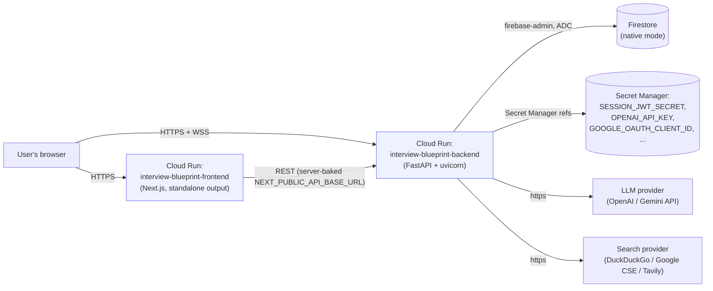

# Deployment

A short bridge document: the production architecture on GCP, a pointer to the actual
deploy procedure, and the behavior differences between local dev and production. The
step-by-step commands live in [deploy/README.md](../../deploy/README.md) and
`deploy/deploy.sh` — this doc explains the *why* and gives a post-deploy checklist; it
does not duplicate the command reference.

## Architecture on GCP

Two Cloud Run services, each built from this repo's own `Dockerfile`
(`backend/Dockerfile`, `frontend/Dockerfile`), plus a native-mode Firestore database and
Secret Manager for sensitive env values. There is no separate database service to
provision or manage — Firestore is fully managed. `gcloud run deploy --source
backend/` builds the backend directly via Cloud Build from source; the frontend is
built explicitly with `gcloud builds submit` + `deploy/cloudbuild-frontend.yaml` because
its `NEXT_PUBLIC_*` values must be baked in as Docker build args (see §3).

## Procedure

Follow [deploy/README.md](../../deploy/README.md) exactly — it covers, in order:
1. One-time GCP setup: enabling APIs (`run`, `cloudbuild`, `artifactregistry`,
   `firestore`, `secretmanager`), creating the Firestore database
   (`gcloud firestore databases create --location=us-central1`), creating the three
   required secrets (`ic-session-jwt-secret`, `ic-openai-api-key`,
   `ic-google-oauth-client-id`) and granting the Cloud Run runtime service account
   `roles/secretmanager.secretAccessor` + `roles/datastore.user`, and creating the
   Google OAuth client.
2. The deploy itself: `export NEXT_PUBLIC_GOOGLE_CLIENT_ID=...` then
   `./deploy/deploy.sh YOUR_PROJECT_ID us-central1`. This deploys the backend first
   (`deploy_backend` in `deploy/deploy.sh`), then the frontend (`deploy_frontend`, which
   reads the backend's freshly-deployed URL to bake in as build args and to derive the
   WS URL by swapping `https:` → `wss:`), then updates the backend's `FRONTEND_ORIGIN`
   env var to the frontend's URL so CORS is correctly wired **after** the frontend URL
   is known — deploy order matters for exactly this reason.
3. `./deploy/deploy.sh <project> <region> backend` or `... frontend` redeploys just one
   side.

## Production behavior differences from local dev

| Aspect | Local dev | Production (Cloud Run) |
|---|---|---|
| Session cookie `Secure` flag | Off (`APP_ENV=development` → `settings.is_production` is `False`) so the cookie still gets set over plain `http://localhost` | On (`APP_ENV=production` is set via `--set-env-vars` in `deploy_backend`) — cookie only sent over HTTPS, which Cloud Run terminates for you |
| Firestore credentials | Either `FIRESTORE_EMULATOR_HOST` (no credentials at all) or a `GOOGLE_APPLICATION_CREDENTIALS` service-account key file | Neither is set — `app/services/firestore.py`'s `get_firestore_client()` falls through to `firebase_admin.initialize_app()` with no explicit credential, which resolves to the Cloud Run service's **default (attached) service account** automatically. No key file is ever deployed. |
| CORS (`FRONTEND_ORIGIN`) | `http://localhost:3000` (from `.env`) | The live frontend Cloud Run URL, set via `gcloud run services update ... --update-env-vars FRONTEND_ORIGIN=...` as the last step of `deploy_frontend` |
| Secrets (`SESSION_JWT_SECRET`, `OPENAI_API_KEY`, `GOOGLE_OAUTH_CLIENT_ID`) | Plain values in `backend/.env` (gitignored) | Mounted from Secret Manager via `--set-secrets` in `deploy_backend` — never baked into the image or set as plain env vars |
| Frontend `NEXT_PUBLIC_*` vars | `frontend/.env.local`, read at `next dev` time | Baked into the client bundle at **image build time** via Docker `ARG`s (`deploy/cloudbuild-frontend.yaml`) — changing them requires a rebuild, not just a redeploy or env var update, because Next.js inlines `NEXT_PUBLIC_*` values into the JS bundle at build time |
| WebSocket support | Native (uvicorn dev server) | Native on Cloud Run too, but the backend is deployed with `--timeout 3600` specifically so long agent runs and long-lived WS connections aren't cut off at Cloud Run's default request timeout |
| Idle cost | N/A (your machine) | `--min-instances 0` on both services by default — scales to zero at idle. Set `--min-instances 1` on the backend if you want to avoid cold-start latency on the first request after idle. |

## Post-deploy checklist

1. **OAuth authorized origins**: add the frontend's live Cloud Run URL (from the
   `deploy_frontend` output) to the Google OAuth client's **Authorized JavaScript
   origins** in [Google Cloud Console → APIs & Services →
   Credentials](https://console.cloud.google.com/apis/credentials) — sign-in will fail
   with a Google-side origin mismatch error until this is done. This is the same client
   ID baked into the frontend build as `NEXT_PUBLIC_GOOGLE_CLIENT_ID` and passed to the
   backend as the `ic-google-oauth-client-id` secret — both sides must agree.
2. **Secrets exist and are granted**: confirm `ic-session-jwt-secret`,
   `ic-openai-api-key`, `ic-google-oauth-client-id` exist in Secret Manager and the
   Cloud Run runtime service account has `roles/secretmanager.secretAccessor` — a
   missing/ungranted secret makes the backend fail to boot (same fail-fast validation
   as local dev; see [backend.md](backend.md) §2).
3. **Firestore database exists** and the runtime service account has
   `roles/datastore.user` — otherwise every Firestore call 500s at runtime (this
   won't be caught at boot, since the client is initialized lazily on first use).
4. **First-deploy ordering**: always deploy the backend before the frontend the very
   first time — `deploy_frontend` hard-fails with `"deploy the backend first"` if it
   can't read the backend's service URL, since that URL must be baked into the frontend
   image.
5. **Extra provider keys** (Gemini, Tavily, Google CSE): add each as its own Secret
   Manager secret, then `gcloud run services update interview-blueprint-backend
   --set-secrets ...` to attach it — same pattern as the three secrets created in
   one-time setup.
6. **Smoke test**: hit `https://<backend-url>/api/healthz` (no auth needed) to confirm
   the backend booted; then load the frontend URL, sign in, complete onboarding, and
   start a curriculum to confirm the WS path and LLM/search provider keys all work
   end-to-end.

## Related documents

- [deploy/README.md](../../deploy/README.md) — the authoritative command reference.
- [setup-cloud-services.md](setup-cloud-services.md) — how to obtain each credential
  referenced above (OAuth client, API keys) in the first place.
- [backend.md](backend.md) §2 and §10 — configuration fail-fast behavior and security
  measures that apply identically in production.
