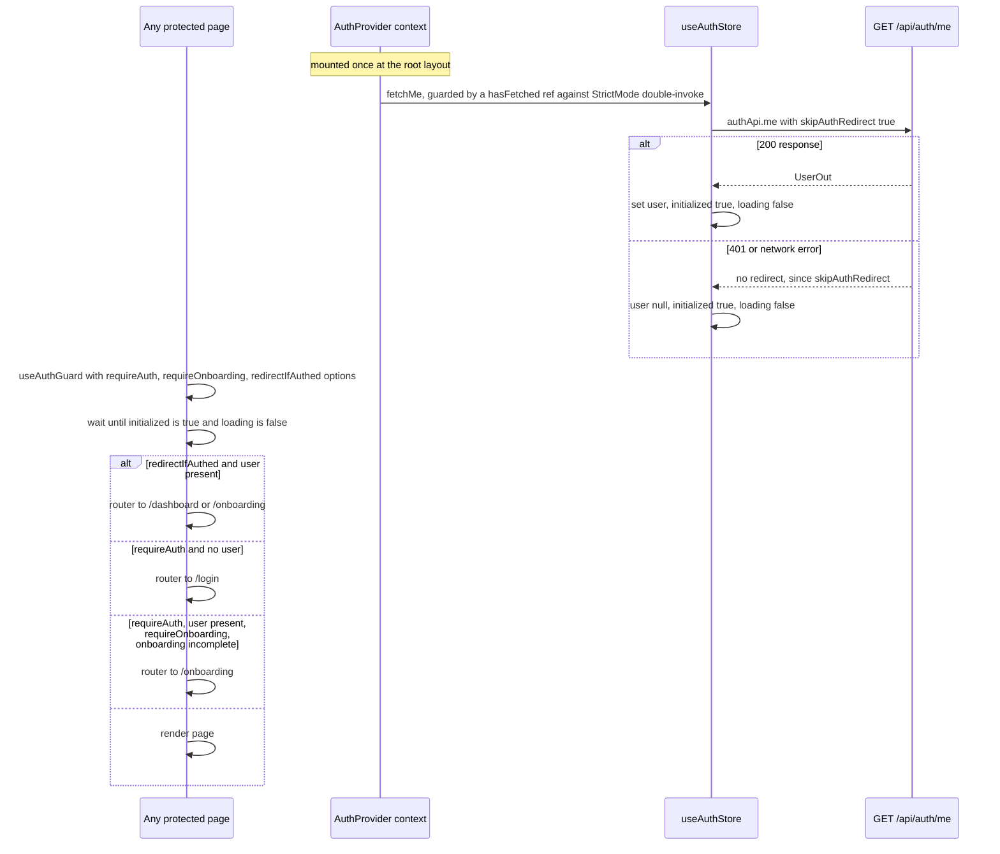

# Frontend deep-dive

A full walkthrough of `frontend/` — the Next.js 15 App Router client. Complements
[docs/specs/03-frontend-spec.md](../specs/03-frontend-spec.md) (the intended UX) with
"how it's actually implemented" detail: real file paths, component/hook/store names, and
exact WS-event-to-store wiring. See [backend.md](backend.md) and
[agent-system.md](agent-system.md) for the server side this UI talks to.

## 1. Routing & layout structure

App Router tree under `frontend/src/app/`:

```
app/layout.tsx                          Root layout (fonts, ThemeProvider, AuthProvider, Toaster)
app/page.tsx                            "/" — public landing
app/login/page.tsx                      "/login" — public
app/onboarding/page.tsx                 "/onboarding" — auth required, no onboarding gate
app/(app)/layout.tsx                    Route group: auth guard + AppShell
app/(app)/dashboard/page.tsx            "/dashboard"
app/(app)/settings/page.tsx             "/settings"
app/(app)/studio/[conversationId]/page.tsx   "/studio/[id]" — THE WORKSPACE
```

**`app/layout.tsx`** loads `Inter` via `next/font/google` bound to CSS variable
`--font-sans-var`, wraps the tree in `ThemeProvider` (`attribute="class"`,
`defaultTheme="system"`, `enableSystem`, `disableTransitionOnChange`) → `AuthProvider` →
`children`, plus a global `<Toaster richColors position="top-right" closeButton />`
from `sonner`. `<html suppressHydrationWarning>` is required by `next-themes` to avoid a
hydration-mismatch warning on the class attribute.

**`app/(app)/layout.tsx`** calls `useAuthGuard({ requireAuth: true, requireOnboarding:
true })` then renders `AppShell` (§3) around `children` — this is the single choke point
enforcing both "must be logged in" and "must have finished onboarding" for every page
under `/dashboard`, `/settings`, `/studio/*`.

**`app/login/page.tsx`** is a client component using `useAuthGuard({ redirectIfAuthed:
true })` — if already authenticated it redirects away from the login page rather than
showing it.

**`app/onboarding/page.tsx`** is a client component implementing the 4-step wizard
(`TOTAL_STEPS = 4`), guarded by `useAuthGuard({ requireAuth: true })` (deliberately
*without* `requireOnboarding`, since this page's whole job is to satisfy that gate).
Local state: `step`, `profile: ProfileIn`, `resumeFilename`, `resumeText`,
`synthesizedProfile`, `direction` (drives the slide direction of the Framer Motion step
transition). Steps: background/bio → target roles + experience + timeline → skills +
goals + learning style + `ResumeDropzone` → review + "Generate my profile" (calls
`onboardingApi.synthesize()`) → finish routes to `/dashboard`.

**`app/(app)/studio/[conversationId]/page.tsx`** unwraps the Next 15 async `params`
promise via `use(params)`. On mount / whenever `conversationId` changes: resets both the
chat and curriculum Zustand stores, sets the new `conversationId`, then fetches
`conversationsApi.messages(conversationId)` and calls `hydrateHistory(messages)`.
`useIsMobile()` returns `boolean | null`; while `null` it renders an empty placeholder to
avoid a layout flash before the viewport check resolves. Desktop: fixed flex split —
chat panel `w-[40%] min-w-[380px] max-w-[560px]`, curriculum panel `flex-1`. Mobile:
a `Tabs` switcher between "chat" and "curriculum" where **only one subtree is mounted at
a time** (an explicit choice to avoid double-mounting React Flow / Mermaid instances).
`handleExplain(prompt)` — wired up from `SectionContent`'s per-heading "Explain" button
through `CurriculumPanel` — prefills the chat composer and, on mobile, switches the
active tab to "chat".

## 2. Auth guard flow



- **`components/auth/AuthProvider.tsx`** — a React Context around `useAuthStore`,
  exposing `useAuth() -> { user, loading, initialized, refresh }`. Fetches `/api/auth/me`
  exactly once (a `hasFetched` ref survives React 19 StrictMode's double-invoke of
  effects in dev).
- **`components/auth/useAuthGuard.ts`** — options `requireAuth`, `requireOnboarding`,
  `redirectIfAuthed` (all default `false`). Returns `{ user, ready }` where `ready =
  initialized && !loading`. Every redirect decision is deferred until `ready` to avoid
  redirect flicker before the `/api/auth/me` call resolves.
- **`stores/useAuthStore.ts`** (Zustand) — `{ user: UserOut | null, loading: boolean
  (starts true), initialized: boolean (starts false) }` plus actions `fetchMe()`,
  `setUser(user)`, `logout()` (calls `authApi.logout()`, clears `user` in a `finally` so
  the UI reflects logged-out state even if the server call fails).
- **`components/auth/GoogleSignInButton.tsx`** — props `{ onCredential: (idToken:
  string) => void; disabled?: boolean }`. Dynamically injects the Google Identity
  Services script (`https://accounts.google.com/gsi/client`) if not already present,
  then calls `window.google.accounts.id.initialize({ client_id, callback, ux_mode:
  "popup" })` and `renderButton` (outline theme, pill shape, width 320, "continue_with"
  text). Renders a warning box if `env.googleClientId` is empty and an error box if the
  script fails to load — both are useful signals while debugging OAuth client
  misconfiguration (see [setup-local.md](setup-local.md)'s troubleshooting section).

`login/page.tsx`'s credential handler calls `authApi.loginWithGoogle(idToken)`, sets the
returned user into `useAuthStore`, then routes to `/dashboard` or `/onboarding`
depending on `user.onboarding_completed` — the same decision `useAuthGuard` would make,
duplicated here to avoid an extra render before the store updates.

## 3. Theming system

Tailwind v4, `next-themes` with the class strategy. Semantic tokens are defined as CSS
custom properties in `frontend/src/app/globals.css`: `:root` holds the light values,
`.dark` overrides them (the dark-mode selector itself is declared via `@custom-variant
dark (&:where(.dark, .dark *))`, matching `next-themes`'s `attribute="class"` output),
and a `@theme inline` block maps them to Tailwind's `--color-*` namespace — this is what
makes utility classes like `bg-background`, `text-foreground`, `bg-card`,
`text-card-foreground`, `bg-popover`, `border-border`, `bg-input`, `ring-ring`,
`bg-muted`, `text-muted-foreground`, `bg-accent`, `text-accent-foreground`,
`bg-accent-soft`, `bg-primary`, `text-primary-foreground`, `bg-secondary`,
`text-secondary-foreground`, `bg-success`, `bg-warning`, `bg-destructive`,
`text-destructive-foreground`, and `bg-info` all resolve correctly in both themes.
`--radius-xl/lg/md/sm` and `--font-sans` (bound to `--font-sans-var`) are defined the
same way. Custom utility classes layered on top: `.bg-gradient-accent` /
`.text-gradient-accent` (3-stop gradient via `--gradient-from/via/to`),
`.scrollbar-thin`, `.shimmer` / `.shimmer-text` (loading shimmer + the "Thinking…" label
animation), `.blinking-caret` (the streaming-text caret), `.prose-chat` / `.prose-reader`
(hand-rolled markdown typography — no `@tailwindcss/typography` plugin is used),
`.mermaid-container svg { max-width: 100% }`, and `.react-flow__attribution { display:
none }` (belt-and-suspenders alongside React Flow's own `proOptions={{
hideAttribution: true }}`).

- **`components/layout/ThemeProvider.tsx`** — a thin re-export of `next-themes`'s
  `ThemeProvider`.
- **`components/layout/ThemeToggle.tsx`** — uses `useTheme()`, guards against a
  hydration mismatch with a `mounted` state (renders an empty placeholder until the
  first client effect runs), and toggles directly between `"light"`/`"dark"` (it does
  not cycle through `"system"` — that's only reachable from the Appearance settings
  tab).

One real inconsistency worth knowing about: `globals.css` unconditionally imports
`highlight.js/styles/github-dark.css` for `rehype-highlight` code blocks, so fenced code
in curriculum sections renders with dark syntax colors even when the app itself is in
light mode.

## 4. Pages

- **Landing (`app/page.tsx`)** — `PublicNavbar` + `Hero` + `Features` + `HowItWorks` +
  `Footer` (all in `components/landing/`). `PublicNavbar`'s Login/Get Started buttons
  use a hard `window.location.href` navigation rather than `next/navigation`'s router —
  inconsistent with the rest of the app's client-side routing, but harmless.
- **Login (`app/login/page.tsx`)** — see §2.
- **Onboarding (`app/onboarding/page.tsx`)** — see §1.
- **Dashboard (`app/(app)/dashboard/page.tsx`)** — a time-of-day `greeting()` helper,
  `PromptBox` (textarea + example-prompt chips; submitting calls
  `conversationsApi.create({ curriculum_prompt })` then routes to `/studio/{id}`), and
  `CurriculumGrid` (fetches `curriculaApi.list()` on mount **and polls every 8000ms** via
  `setInterval` for live status/progress updates — a second, independent update
  mechanism from the WS-driven live updates used inside Studio, since the dashboard has
  no open WS connection of its own). `CurriculumCard` maps `CurriculumStatus` to a
  label/Badge-variant via a `STATUS_META` dict, shows a progress bar for
  `researching|planning|writing`, and wraps delete in a `ConfirmDialog`.
- **Settings (`app/(app)/settings/page.tsx`)** — a custom (non-Radix) `Tabs` component
  with four tabs: `ProfileTab` (read-only profile display, "Edit background" links to
  `/onboarding`), `PreferencesTab` (LLM provider select and search provider select —
  see the discrepancy note below), `AppearanceTab` (light/dark/system), `AccountTab`
  (email + logout).

## 5. The Studio (`app/(app)/studio/[conversationId]/page.tsx`)

### 5.1 `ChatSocket` — `lib/ws.ts`

A small class managing one WebSocket connection with reconnect/backoff, keepalive, and
typed send/receive helpers. Connection states: `"idle" | "connecting" | "open" |
"reconnecting" | "closed"`.

- **URL**: `` `${env.wsBaseUrl}/ws/chat/${conversationId}` `` (`env.wsBaseUrl` defaults
  to `ws://localhost:8000`, from `NEXT_PUBLIC_WS_BASE_URL`).
- **Reconnect/backoff** (exact algorithm): `BASE_BACKOFF_MS = 500`, `MAX_BACKOFF_MS =
  15_000`. On each scheduled reconnect attempt: `backoff = Math.min(BASE_BACKOFF_MS *
  2 ** attempt, MAX_BACKOFF_MS)`, then jitter `Math.random() * 0.3 * backoff` is
  **added on top** (so the actual delay can exceed 15s by up to ~30%, capping practically
  around 19.5s). `reconnectAttempt` increments every scheduled attempt and resets to 0
  on a successful `onopen`. Reconnection is skipped entirely if `.close()` was called
  explicitly (`manuallyClosed` flag).
- **Keepalive**: sends `{type: "ping"}` every `PING_INTERVAL_MS = 25_000` starting at
  `onopen`; the interval is cleared on any close.
- `onerror` is intentionally a no-op — `onclose` is the single place that decides
  whether to reconnect, avoiding duplicate reconnect scheduling from both handlers
  firing.
- Public surface: `connect()`, `close()`, `onEvent(handler)`, `onStateChange(handler)`,
  `getState()`, `send(event)`, plus typed helpers `sendUserMessage(content)`,
  `sendPlanDecision(decision, feedback)`, `sendStop()`.

### 5.2 `useChatSocket` — `hooks/useChatSocket.ts`

Owns the `ChatSocket` instance's lifecycle keyed on `conversationId` (creates/tears down
on change or unmount) and contains the **entire WS-event-to-store dispatch table**:

| WS event | Store action invoked | Effect |
|---|---|---|
| `session_ready` | `useChatStore.setCurriculumId(curriculum_id)` | |
| `message_start` | `startMessage(message_id)` | appends a new assistant message (idempotent on repeat id), sets `agentRunning: true` |
| `reasoning_delta` | `appendReasoningDelta(id, delta)` | appends to `reasoning`, `reasoningStreaming: true` |
| `text_delta` | `appendTextDelta(id, delta)` | appends to `content`, `contentStreaming: true` |
| `tool_call_start` | `startToolCall(messageId, toolCallId, name, input)` | pushes a `running` tool-call record onto the message, prepends an activity-feed item |
| `tool_call_result` | `resolveToolCall(messageId, toolCallId, outputPreview, status, elapsedMs)` | updates the tool call and matching activity item's status/detail. **`elapsedMs` is accepted but discarded — never stored** (see discrepancy below). |
| `message_end` | `endMessage(id)` | clears both streaming flags, `agentRunning: false` |
| `phase_change` | `setPhase(phase, label)` | |
| `progress` | `setProgress(completed, total, detail)` | |
| `plan_proposed` | `proposePlan(plan)` | sets `plan`, `planAwaitingDecision: true` |
| `curriculum_updated` | `useCurriculumStore.refetch({scope, moduleId, sectionId})` | a *different* store — refetches the full curriculum from REST |
| `compaction` | none (chat store untouched) | `toast.info(...)` only |
| `agent_done` | `setAgentRunning(false)` | |
| `error` | none directly | `toast.error(message)`; if `!recoverable`, also `setAgentRunning(false)` |
| `pong` | none | no-op |

`useChatSocket` also drives connection-state toasts: a persistent `toast.loading(
"Reconnecting…", {id: "ws-reconnect"})` while `connectionState === "reconnecting"`, and
on a successful reopen either `toast.success("Reconnected", {id: "ws-reconnect"})` (if
it actually had been reconnecting) or a silent dismiss.

### 5.3 Stores

**`stores/useChatStore.ts`** shape:

```ts
conversationId, curriculumId: string | null
messages: ChatMessage[]   // { id, role, content, reasoning, reasoningStreaming, contentStreaming, tool_calls, created_at, seq }
phase, phaseLabel: string | null
progress: { completed, total, detail } | null
plan: ProposedPlan | null            // { outline_markdown, tasks, version }
planAwaitingDecision: boolean
agentRunning: boolean
activity: ActivityItem[]             // capped at 30, most-recent-first
connectionState: "idle" | "connecting" | "open" | "reconnecting" | "closed"
```

Additional actions beyond the event table above: `addUserMessage(content)` (optimistic
local echo with a synthetic `local-{timestamp}-{random}` id, sent before the server's
own message arrives), `hydrateHistory(messages)` (maps `MessageOut[]` from `GET
/api/conversations/{id}/messages` into `ChatMessage[]`, sorted by `seq` — this is what
repopulates the chat on page load/refresh), `resolvePlan()` (clears
`planAwaitingDecision` when the user submits a decision — a store-local action, **not**
triggered by any WS event, since the actual pause-lift only happens once the backend
starts a new turn), `reset()` (clears everything except the ids), `setConnectionState`.

**`stores/useCurriculumStore.ts`** shape: `{ curriculum: CurriculumFull | null, loading,
error, lastUpdatedScope: {scope, moduleId?, sectionId?} | null }`. `fetchCurriculum(id)`
does the initial `GET /api/curricula/{id}` load; `refetch(scope?)` **bails silently if
`curriculum` is currently null** — i.e. it only ever replaces already-loaded data, so
`CurriculumPanel` must call `fetchCurriculum` on mount/id-change before any
`curriculum_updated`-triggered `refetch` can do anything.

### 5.4 Chat panel components (`components/studio/chat/`)

- **`ChatPanel.tsx`** — props `{ conversationId, socketRef, historyLoading,
  historyError, prefillText?, onPrefillConsumed? }`. Manages the composer draft and
  auto-scroll (tracks whether the user scrolled up more than 80px from the bottom to
  decide whether to show `ScrollToBottomPill` instead of auto-scrolling).
  `composerDisabled = planAwaitingDecision || connectionState !== "open"`. Render order:
  `PhaseBanner` → a reconnecting banner (if `connectionState === "reconnecting"`) →
  message list (empty/loading/error states, else an `AnimatePresence` list of
  `MessageBubble`s) → `PlanApprovalCard` (when a plan awaits a decision) →
  `ScrollToBottomPill` → `Composer`.
- **`Composer.tsx`** — auto-growing textarea (height capped at 200px), Enter sends
  (Shift+Enter inserts a newline), swaps to a stop button while `running`.
- **`MessageBubble.tsx`** (`memo`-wrapped) — renders an avatar, `ReasoningBlock` (if
  `reasoning` present, assistant only), a `ToolCallGroup` (if any tool calls, assistant
  only), then the content: plain `whitespace-pre-wrap` text for user messages,
  `ReactMarkdown` (remark-gfm + rehype-highlight) for assistant messages, with a
  `blinking-caret` span appended while `contentStreaming`.
- **`PhaseBanner.tsx`** — maps `phase` to a lucide icon (`PHASE_ICONS`: research→Search,
  planning→ListChecks, awaiting_approval→Compass, writing→PenLine, ready→CheckCircle2,
  default→Sparkles), stops the spin animation once `phase === "ready"`, shows a progress
  bar when `progress.total > 0`.
- **`PlanApprovalCard.tsx`** — renders `outline_markdown` (ReactMarkdown+remark-gfm) and
  a task checklist (checkmark when `status === "done"`); toggles between an idle
  [Approve & build]/[Request changes] row and a feedback-textarea row, calling
  `onDecision(decision, feedback)` which the page wires to `socket.sendPlanDecision(...)`.
- **`ReasoningBlock.tsx`** — collapsible, `open` initialized to the `streaming` prop
  (auto-expanded while reasoning is actively arriving), header reads "Thinking…"
  (shimmer) while streaming or "Thought process" once done; renders `null` if there's no
  reasoning text.
- **`ToolCallCard.tsx`** — exports `ToolCallGroup({ calls })`; icon is `Search` if the
  (lowercased) tool name contains `"search"`, else `Wrench`; status icon is a spinning
  `Loader2` (running), `CheckCircle2` (ok), or `XCircle` (error); expands to show
  pretty-printed JSON input and the output preview.

### 5.5 Curriculum panel components (`components/studio/curriculum/`)

`CurriculumPanel.tsx` dynamically imports **both** `WorkflowView` and `ReaderView` with
`dynamic(..., { ssr: false })` (the spec 03 §5 requirement — Mermaid/xyflow must never
render server-side). It toggles a local `view: "workflow" | "reader"` (default
`"workflow"`); render precedence: no `curriculumId` → `EmptyState`; loading with no data
yet → spinner; error with no data → `EmptyState`; curriculum loaded but no modules yet →
`ActivityFeed` (the pre-content activity mirror described in spec 03); otherwise the
selected view. `handleSelectModule(order)` switches to `"reader"` and sets
`activeModuleOrder`.

- **`ActivityFeed.tsx`** — a spinning `Sparkles` header showing `phaseLabel`, an
  `AnimatePresence`+`layout`-animated list of the most recent 12 activity items, plus
  skeleton placeholders for the outline-to-come. `humanizeLabel` prefixes "Searching: "
  or "Reading: " based on keyword matching the tool name.
- **`MermaidDiagram.tsx`** — a **raw dynamic ESM `import("mermaid")`** inside a
  `useEffect` (not a Next `dynamic()` call — appropriate since this is a plain library,
  not a React component), re-rendering whenever the `chart` string or `next-themes`'s
  `resolvedTheme` changes. Calls `mermaid.initialize({ startOnLoad: false, theme:
  dark-or-default, securityLevel: "strict", fontFamily: "var(--font-sans-var),
  sans-serif" })` and injects the rendered SVG via `dangerouslySetInnerHTML` (justified
  by `securityLevel: "strict"`).
- **`ReaderView.tsx`** — a left mini-TOC (module/section tree with status icons:
  `Circle`/`Loader2`/`CheckCircle2` for planned/writing/complete) rendered as a sidebar
  at `lg+`; below `lg` the same tree is available from a sticky "Contents" header row
  that opens an animated dropdown (Framer Motion, click-outside-to-close, mirroring the
  `UserMenu.tsx` pattern) and closes on selection. Both share the scroll-to-section
  logic that brings the chosen `#module-{id}`/section into view.
- **`SectionContent.tsx`** — custom `ReactMarkdown` `components` overrides: a `code`
  renderer intercepts ` ```mermaid ` fences and renders `<MermaidDiagram>` instead of a
  code block; an `h2` renderer appends an always-rendered, muted "Explain" icon button
  (touch- and keyboard-accessible, `aria-label`ed, brightens on hover/focus) that calls
  `onExplain('Explain "<heading>" in simpler terms')`; an `a` renderer special-cases
  footnote-reference links (`href` starting with
  `#user-content-fn-` or `#fn-`) into small superscript chips, and gives ordinary
  external links `target="_blank" rel="noopener noreferrer"`.
- **`SourcesCard.tsx`** — renders `null` for empty citations; each entry gets a Google
  favicon (`https://www.google.com/s2/favicons?domain={hostname}&sz=32` — an external
  network call with no self-hosted fallback), a numbered badge, and an external-link
  icon.
- **`WorkflowView.tsx`** — `@xyflow/react` canvas. `buildLayout()` places the Start node
  at the top and lays module nodes out in a **hand-rolled serpentine 2-column grid**
  (`COLS = 2`, alternating left/right per row, fixed `NODE_WIDTH`/`NODE_HEIGHT`/`V_GAP`),
  connecting them sequentially with `status` edges (`data.animated = status ===
  "writing"`). `fitView({ padding: 0.25, duration: 300 })` re-runs (via
  `requestAnimationFrame`) whenever the module count changes. The canvas is read-only:
  `nodesDraggable={false}`, `nodesConnectable={false}`, `elementsSelectable={false}`.
  `colorMode` follows `next-themes`. Note: **`dagre` is listed in `package.json` but is
  not imported or used anywhere in this file** — the layout is entirely hand-rolled grid
  math, not a dagre auto-layout call; this looks like a leftover dependency from an
  earlier layout approach.
- **`edges/StatusEdge.tsx`** — a custom `Edge` using `getSmoothStepPath` (12px border
  radius); dashed + CSS-animated stroke (`xyflow-dash` keyframe in `globals.css`) when
  `data.animated`.
- **`nodes/ModuleNode.tsx`** / **`nodes/StartNode.tsx`** — custom node types keyed off
  `status` (`planned` = dashed border, `writing` = solid accent border + an animated
  progress-shimmer bar, `complete` = success-tinted border) and a gradient Start pill
  respectively.

## 6. `lib/api.ts` conventions

`apiFetch<T>(path, options)` is the single fetch wrapper every API namespace builds on:
- Always sends `credentials: "include"` (required for the `ic_session` cookie).
- Automatically attaches `X-Requested-With: XMLHttpRequest` for any mutating method
  (`POST`/`PUT`/`PATCH`/`DELETE`) — callers never need to remember the CSRF header.
- Supports an `isFormData` flag to pass a `FormData` body through untouched (used by
  resume upload) instead of JSON-stringifying it.
- On a network-level failure (fetch itself throws), raises `ApiError(0, "Network error —
  could not reach the server.", null)`.
- On a **401** response, unless the call opted into `skipAuthRedirect` (used by
  `authApi.me()` and `healthApi.check()` so those two calls can fail without bouncing
  the whole app to `/login`), it does a hard `window.location.href = "/login"` **and**
  throws `ApiError(401, ...)` — callers that do need to observe 401 without redirecting
  must pass that flag explicitly.
- Parses the body as JSON only when the response `content-type` includes
  `application/json`; on a non-OK response it builds the `ApiError` message from the
  body's `detail` (a string, or a FastAPI-validation-style array of `{msg}` objects
  joined by `"; "`) or `message`.

API namespaces (all in `lib/api.ts`): `authApi` (`loginWithGoogle`, `logout`, `me`),
`onboardingApi` (`get`, `update`, `uploadResume`, `synthesize`), `curriculaApi` (`list`,
`get`, `remove`, `plan`), `conversationsApi` (`list`, `create`, `messages`),
`settingsApi` (`get`, `update`), `healthApi` (`check`, with `skipAuthRedirect: true`).

`lib/types.ts` is a hand-maintained TypeScript mirror of every shape in spec 01 —
notably the `ClientEvent` union (`user_message | plan_decision | stop | ping`) and the
full `ServerEvent` union (all 14 event types) match the backend's WS protocol exactly.

`lib/env.ts`'s `readEnv(name, fallback)` exposes exactly three values:
`apiBaseUrl` (`NEXT_PUBLIC_API_BASE_URL`, default `http://localhost:8000`), `wsBaseUrl`
(`NEXT_PUBLIC_WS_BASE_URL`, default `ws://localhost:8000`), `googleClientId`
(`NEXT_PUBLIC_GOOGLE_CLIENT_ID`, default `""`).

`lib/utils.ts`: `cn()` (clsx + tailwind-merge), `timeAgo(iso)`, `initials(name)`, and
`formatElapsed(ms)` — the last of which is currently **exported but never called
anywhere** (see discrepancies below).

## 7. How to add a new page/component consistently

1. **New page**: add a folder+`page.tsx` under `app/`. If it needs auth, wrap it (or its
   layout) with `useAuthGuard({ requireAuth: true, ...})`; if it belongs inside the
   authenticated shell, put it under the `(app)` route group so it inherits
   `AppShell`/the auth+onboarding guard automatically rather than re-implementing it.
2. **New component**: colocate under the most specific existing folder
   (`components/studio/chat/`, `components/studio/curriculum/`, `components/dashboard/`,
   `components/onboarding/`, `components/settings/`, or `components/ui/` for a generic
   primitive). Use `forwardRef` + the shared `cn()` helper + semantic Tailwind tokens
   (never hardcode a hex color — use `bg-card`, `text-muted-foreground`, etc. so both
   themes stay correct for free). Match the existing hand-rolled primitive style in
   `components/ui/` (no Radix/shadcn dependency to reach for).
3. **New WS event type**: add it to both the backend event dict (see
   [agent-system.md](agent-system.md) / `backend/app/ws/chat.py`) and the `ServerEvent`
   union in `lib/types.ts`, then add a case to the dispatch table in
   `hooks/useChatSocket.ts` that calls a new or existing Zustand action.
4. **New store state**: prefer extending `useChatStore`/`useCurriculumStore` if the data
   is chat- or curriculum-scoped; only add a new store for a genuinely separate concern
   (mirroring `useAuthStore`'s scope).
5. **Any component touching Mermaid or `@xyflow/react`**: must be loaded with
   `dynamic(..., { ssr: false })` (component-level) or a runtime `import(...)` inside an
   effect (library-level, as `MermaidDiagram.tsx` does) — never a top-level static
   import, or the build will try to server-render a browser-only library.
6. **Verify**: `npm run build` must pass with zero TypeScript errors before considering
   any change done (per the root and frontend `CLAUDE.md`).

## Notable behaviors beyond `docs/specs/03-frontend-spec.md`

1. **`CurriculumGrid` polls `curriculaApi.list()` every 8 seconds** on the dashboard so
   in-progress curricula update live there — an intentional mechanism separate from the
   WS-driven updates used inside Studio (the dashboard has no WS connection).
2. **Tool-call timing**: `tool_call_result`'s `elapsed_ms` is stored on the live
   `ToolCallRecord` (optional field — absent for hydrated history, which doesn't persist
   it) and shown in `ToolCallCard` via `formatElapsed()` once a call finishes.
3. **"Explain this"** is an always-rendered muted icon button next to each section `<h2>`
   in `SectionContent.tsx` (keyboard- and touch-accessible; brightens on hover/focus),
   which prefills the chat composer via `onExplain(...)`.
4. **Reader TOC responsiveness**: the sidebar TOC renders at `lg+`; below `lg`,
   `ReaderView.tsx` shows a sticky "Contents" header row that opens an animated dropdown
   with the same module/section tree and scroll-to-section behavior.
5. **Code-block syntax highlighting** is a hand-written dual-theme hljs palette at the
   end of `globals.css` (GitHub-light colors under `:root`, GitHub-dark under `.dark`)
   rather than an imported highlight.js stylesheet.

## Related documents

- [backend.md](backend.md) — the REST/WS surface this frontend consumes.
- [agent-system.md](agent-system.md) — what generates the events rendered here.
- `frontend/CLAUDE.md` — terse scoped conventions for AI-assisted edits.
